# Agent Mitra - Comprehensive User Journey Flow Diagrams

## 1. User Journey Overview

### 1.1 Journey Philosophy & Design Principles

#### User-Centric Design Approach
```
🎯 USER JOURNEY DESIGN PHILOSOPHY

🎨 Core Principles:
├── Simplicity First: Intuitive flows for non-tech-savvy users
├── Progressive Disclosure: Show only relevant information
├── Contextual Help: AI assistance at every step
├── Error Prevention: Guide users away from mistakes
├── Emotional Design: Build trust and confidence
└── Accessibility: Inclusive design for all users

📊 Success Metrics:
├── Task Completion Rate: >85%
├── User Satisfaction Score: >4.2/5
├── Error Rate: <5%
├── Support Ticket Reduction: 60%
└── Feature Adoption Rate: >70%
```

#### Multi-User Persona Framework
```
👥 USER PERSONAS & JOURNEYS

🎭 Primary Personas:
├── 👴 Senior Citizens (40%): Simple, large text, voice assistance
├── 👨‍💼 Working Professionals (30%): Quick actions, mobile-optimized
├── 🏘️ Rural Users (20%): Low bandwidth, offline capabilities
├── 👩‍💻 Young Adults (10%): Feature exploration, social sharing
└── 🧑‍🤝‍🧑 Agents (100%): Business tools, analytics, efficiency

📈 Journey Stages:
├── Awareness → Consideration → Purchase → Retention → Advocacy
├── Onboarding → Habit Building → Feature Discovery → Power User
├── Problem → Search → Evaluation → Selection → Usage → Loyalty
└── Need Recognition → Information Search → Evaluation → Purchase → Post-Purchase
```

## 2. Customer Journey Flows

### 2.1 Customer Onboarding & Registration

#### New User Discovery & Download
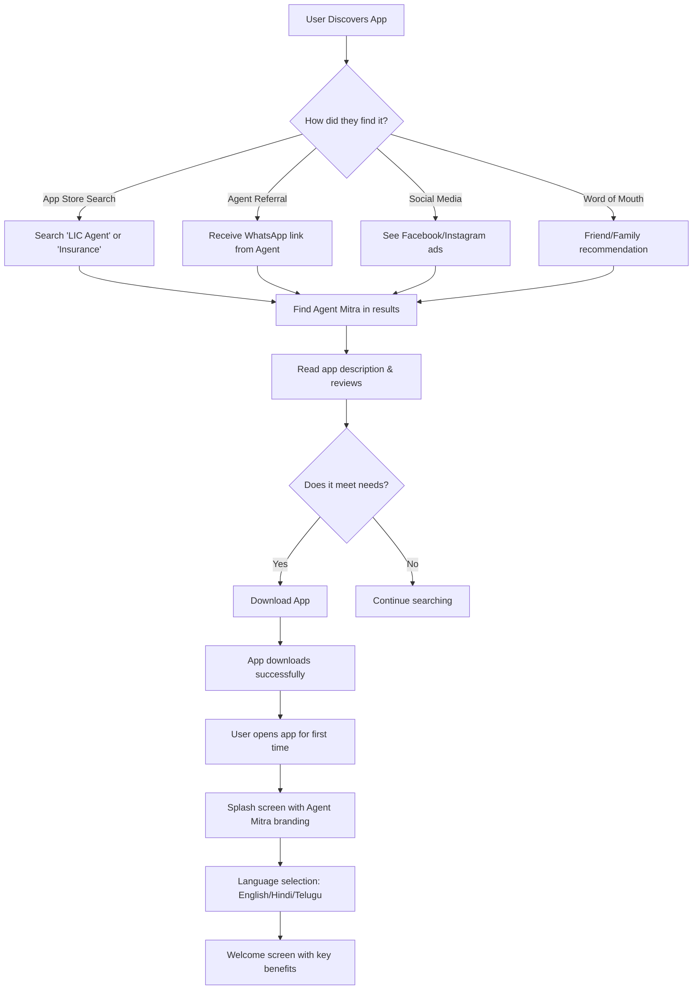

#### Registration & Profile Setup
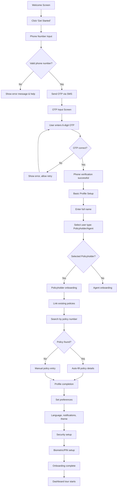

#### Profile Completion & Verification
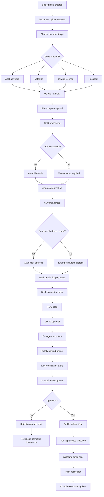

### 2.2 Policy Management Journey

#### Policy Discovery & Linking
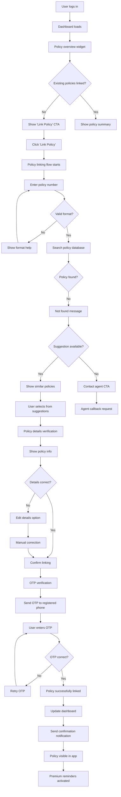

#### Policy Details Exploration
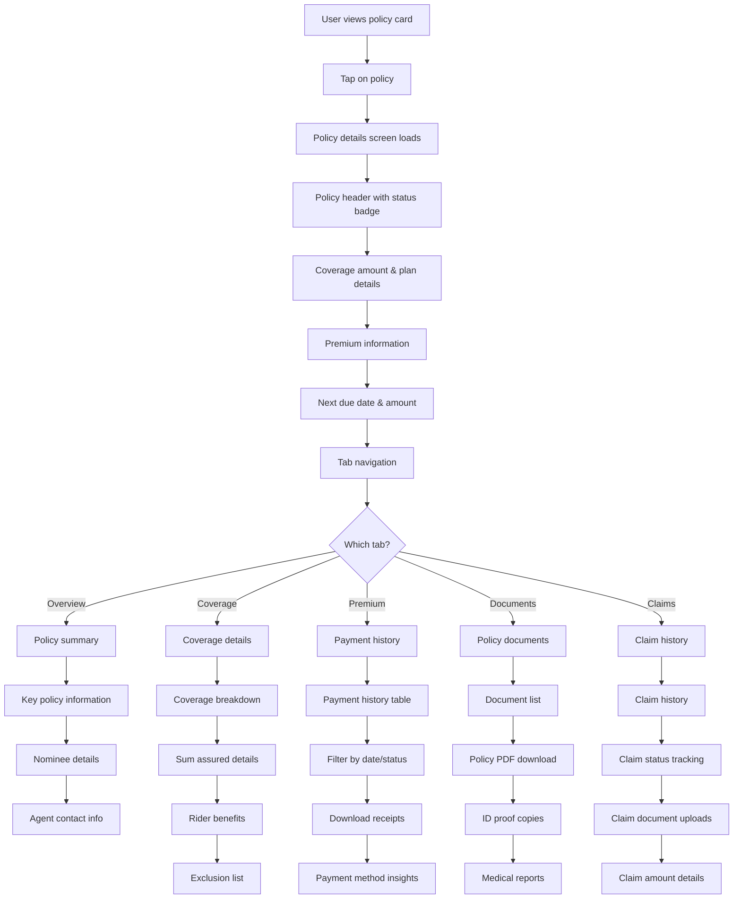

### 2.3 Payment Processing Journey

#### Premium Payment Flow
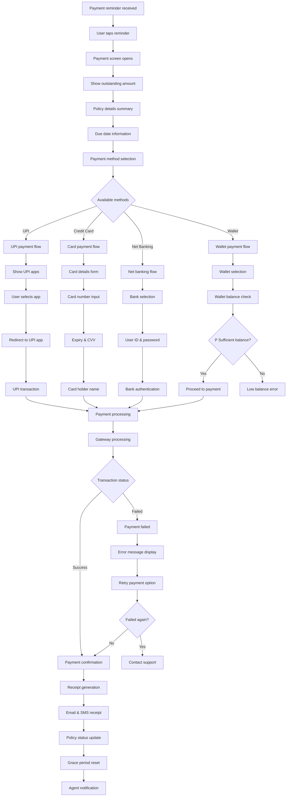

#### Payment Method Setup
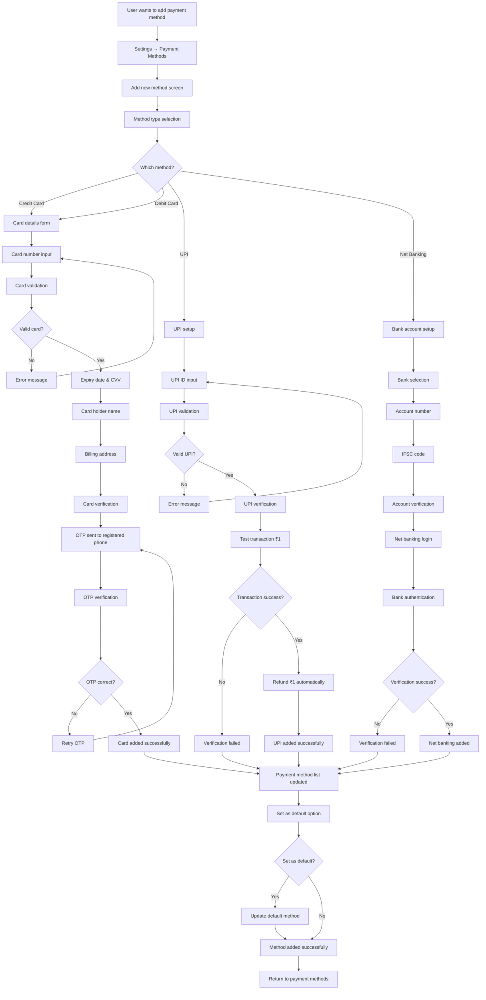

### 2.4 Chatbot & Support Journey

#### AI Chatbot Interaction Flow
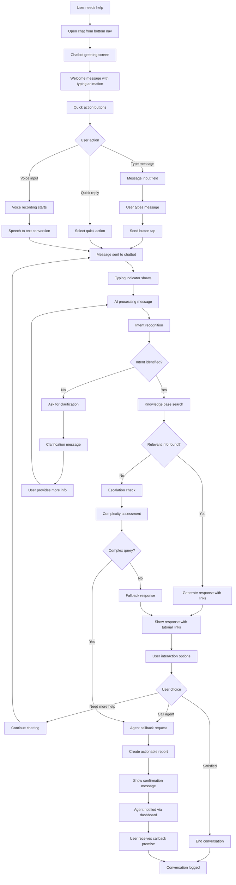

#### Agent Callback Request Flow
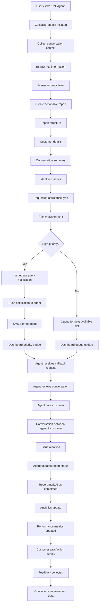

### 2.5 Agent Dashboard & Management Journey

#### Agent Daily Workflow
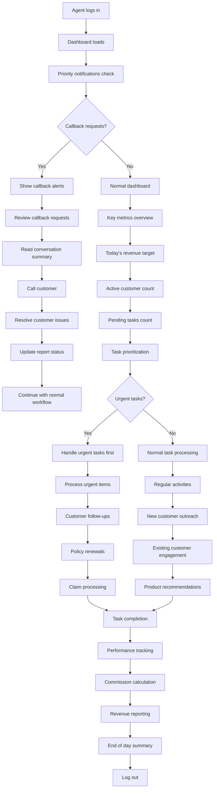

#### Campaign Management Journey
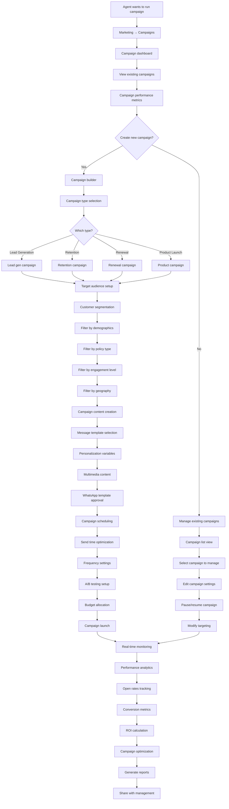

## 3. Admin & System Management Journeys

### 3.1 Super Admin System Management

#### Feature Flag Management
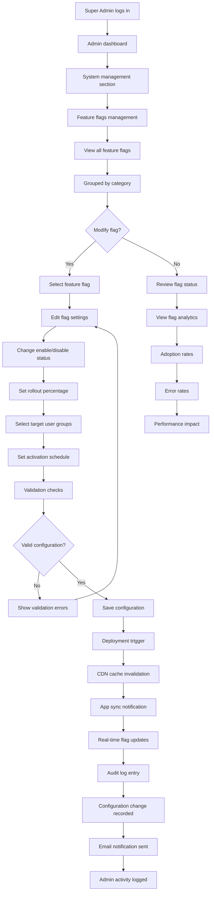

#### User Management & Support
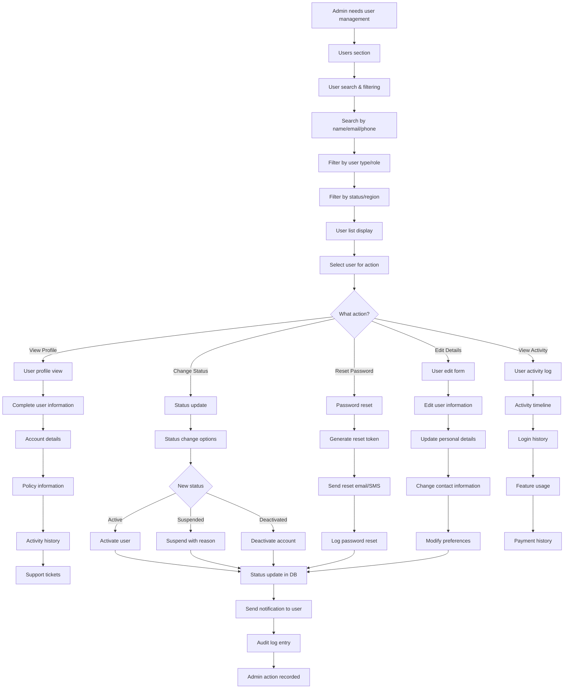

## 4. Error Handling & Recovery Journeys

### 4.1 Network Error Recovery

#### Offline Mode Handling
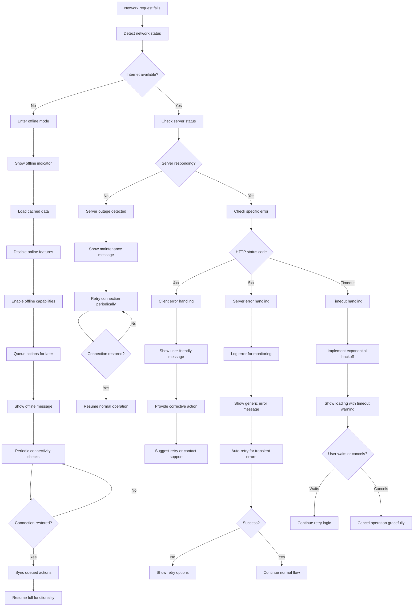

### 4.2 Payment Failure Recovery

#### Payment Error Handling
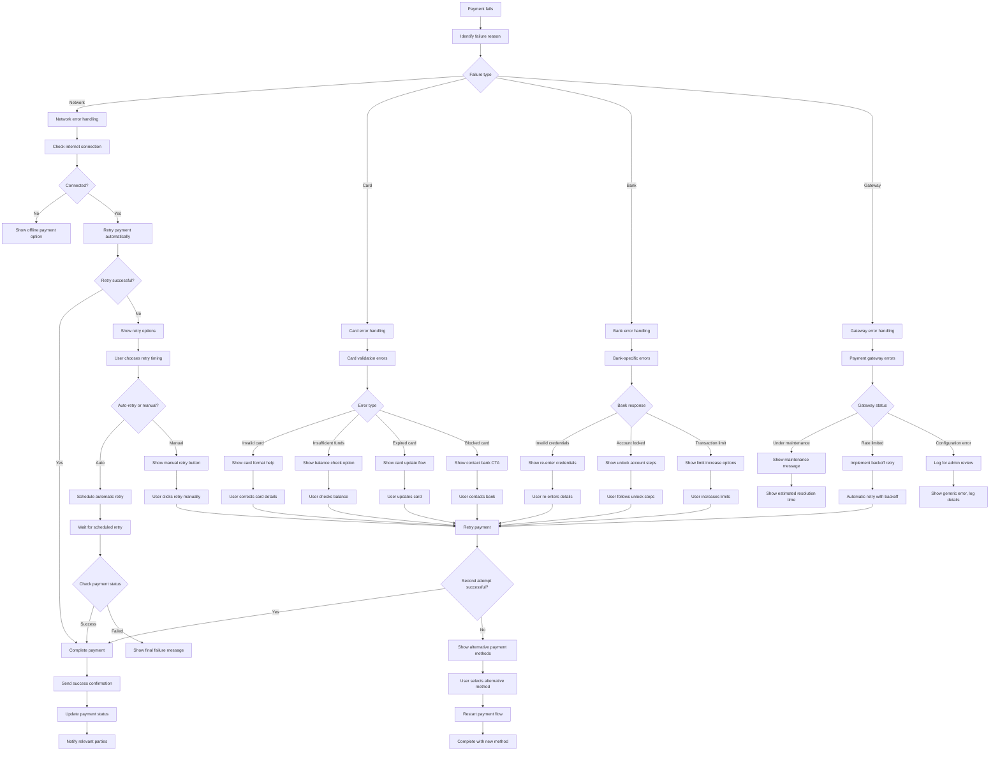

## 5. Cross-Platform User Experience

### 5.1 Responsive Design Journey

#### Device Adaptation Flow
```mermaid
flowchart TD
    A[User opens app on device] --> B[Device detection]
    B --> C{Device type}
    C -->|Mobile Phone| D[Mobile layout]
    C -->|Tablet| E[Tablet layout]
    C -->|Web Browser| F[Web responsive layout]

    D --> G[Screen size detection]
    E --> G
    F --> G

    G --> H{Screen size}
    H -->|Small (<600px)| I[Single column layout]
    H -->|Medium (600-1200px)| J[Two column layout]
    H -->|Large (>1200px)| K[Multi-column layout]

    I --> L[Bottom navigation tabs]
    I --> M[Simple card layouts]
    I --> N[Touch-optimized buttons]

    J --> O[Side navigation drawer]
    J --> P[Grid card layouts]
    J --> Q[Medium-sized buttons]

    K --> R[Persistent sidebar]
    K --> S[Advanced grid layouts]
    K --> T[Desktop-style buttons]

    L --> U[Content adaptation]
    O --> U
    R --> U

    U --> V[Text size adjustment]
    V --> W[Image optimization]
    W --> X[Feature prioritization]

    X --> Y[Essential features always visible]
    Y --> Z[Secondary features in menus/drawers]
    Z --> AA[Advanced features contextually hidden]

    AA --> BB[User interaction monitoring]
    BB --> CC[Adapt UI based on usage patterns]
    CC --> DD[Personalized experience]
```

### 5.2 Multi-Language Experience Journey

#### Language Switching Flow
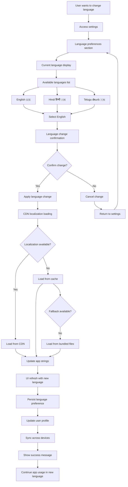

This comprehensive user journey documentation provides detailed flow diagrams for all major user interactions within the Agent Mitra platform, ensuring intuitive and efficient user experiences across different personas and use cases.
