# Agent Mitra - Deployment Design & Infrastructure Architecture

> **Note:** This document demonstrates [Separation of Concerns](../design/glossary.md#separation-of-concerns) through independent deployment strategies for Agent Mitra Mobile App, Agent Mitra Config Portal/Website, and Official LIC Systems.

## 1. Deployment Philosophy & Cost Optimization Strategy

### 1.1 Core Deployment Principles
- **Cost-Effective Scaling**: Start lean, scale intelligently based on user growth
- **Performance-First**: Maintain sub-200ms response times even during peak loads
- **Security-Compliance**: IRDAI and DPDP compliant infrastructure from day one
- **Developer Productivity**: Fast local development with production parity
- **Monitoring-Driven**: Comprehensive observability for proactive optimization

### 1.2 Cost Optimization Strategy

```
💰 COST OPTIMIZATION FRAMEWORK

🎯 Optimization Targets:
├── Infrastructure: 40% cost reduction through smart scaling
├── Database: 35% savings with efficient indexing and caching
├── CDN & Storage: 15% reduction via compression and lifecycle policies
└── Monitoring: 10% savings through targeted observability

📊 Scaling Strategy:
├── Phase 1 (MVP): 700 users, ₹15,000/month target
├── Phase 2 (Growth): 5,000 users, ₹45,000/month target
├── Phase 3 (Scale): 50,000 users, ₹150,000/month target
└── Phase 4 (Enterprise): 500,000 users, ₹450,000/month target

🔧 Cost Control Mechanisms:
├── Auto-scaling based on demand patterns
├── Reserved instances for predictable workloads
├── Spot instances for batch processing
├── Intelligent caching and CDN optimization
└── Database query optimization and indexing
```

## 2. Infrastructure Architecture (Cost-Optimized)

### 2.1 Overall Architecture Diagram

```mermaid
---
config:
  layout: elk
---
flowchart LR
 subgraph subGraph0["📱 End Users"]
        Mobile["Agent Mitra Mobile App<br>iOS + Android"]
        Portal["Agent Mitra Config Portal<br>Web Portal<br>Data Management"]
        WhatsApp["WhatsApp Business<br>Customer Communication"]
  end
 subgraph subGraph1["🌐 Global Edge (CloudFront)"]
        CDN["CloudFront CDN<br>Global Distribution<br>310+ Edge Locations"]
        WAF["WAF &amp; Shield<br>DDoS Protection<br>SSL Termination"]
        Route53["Route 53<br>Global DNS<br>Health Checks"]
  end
 subgraph Microservices["Microservices"]
        API["FastAPI Backend<br>REST APIs<br>GraphQL"]
        Chatbot["Chatbot Service<br>NLP Processing<br>Intent Recognition"]
        WhatsAppSvc["WhatsApp Service<br>Message Processing<br>Template Management"]
        VideoSvc["Video Processing<br>Content Moderation<br>YouTube Integration"]
        DataImportSvc["Data Import Service<br>Excel Processing<br>Background Jobs"]
        CallbackSvc["Callback Management<br>Priority Queue<br>Agent Assignment"]
        CampaignSvc["Campaign Analytics<br>Performance Tracking<br>ROI Analysis"]
        ContentSvc["Content Analytics<br>Video Performance<br>Engagement Metrics"]
        RealtimeSvc["WebSocket Server<br>Real-time Updates<br>Live Dashboards"]
  end
 subgraph subGraph3["🚀 Application Layer (ECS Fargate)"]
        ALB["Application Load Balancer<br>Auto Scaling<br>SSL Termination"]
        Microservices
  end
 subgraph subGraph4["🤖 AI/ML Layer (Lambda + External APIs)"]
        OpenAI["OpenAI API<br>Chatbot Responses<br>Content Generation"]
        Perplexity["Perplexity API<br>Enhanced Search<br>Knowledge Base"]
        AWSComprehend["AWS Comprehend<br>Text Analysis<br>Sentiment Analysis"]
        CustomML["Custom ML Models<br>Predictive Analytics<br>Recommendation Engine"]
  end
 subgraph subGraph5["Primary Region (Mumbai)"]
        AuroraPrimary["Aurora PostgreSQL<br>Primary DB<br>Auto-scaling"]
        RedisPrimary["Redis Cluster<br>Session Cache<br>Application Cache"]
  end
 subgraph subGraph6["Secondary Region (Singapore)"]
        AuroraReplica["Aurora Read Replicas<br>Performance Optimization<br>Disaster Recovery"]
        RedisReplica["Redis Replica<br>Global Cache<br>Failover Support"]
  end
 subgraph subGraph7["💾 Data Layer (Multi-Region)"]
        subGraph5
        subGraph6
        S3["S3 Storage<br>File Storage<br>CDN Origin<br>Lifecycle Policies"]
  end
 subgraph subGraph8["📊 Monitoring & Analytics"]
        CloudWatch["CloudWatch<br>Metrics &amp; Logs<br>Custom Dashboards"]
        NewRelic["New Relic APM<br>Performance Monitoring<br>Distributed Tracing"]
        Sentry["Sentry<br>Error Tracking<br>Release Health"]
        Mixpanel["Mixpanel<br>User Analytics<br>Behavioral Insights"]
  end
    Mobile --> CDN
    Portal --> CDN
    WhatsApp --> WhatsAppSvc
    CDN --> WAF
    WAF --> ALB
    ALB --> API & Chatbot & WhatsAppSvc & VideoSvc & DataImportSvc & CallbackSvc & CampaignSvc & ContentSvc & RealtimeSvc
    API --> AuroraPrimary & RedisPrimary & S3 & CloudWatch
    Chatbot --> OpenAI & Perplexity & CloudWatch
    VideoSvc --> AWSComprehend & CustomML & S3 & CloudWatch
    DataImportSvc --> AuroraPrimary & S3 & CloudWatch
    CallbackSvc --> AuroraPrimary & RedisPrimary & CloudWatch
    CampaignSvc --> AuroraPrimary & RedisPrimary & CloudWatch
    ContentSvc --> AuroraPrimary & RedisPrimary & CloudWatch
    AuroraPrimary --> AuroraReplica
    RedisPrimary --> RedisReplica
    WhatsAppSvc --> CloudWatch
    CloudWatch --> NewRelic & Sentry & Mixpanel
     Mobile:::primary
     Portal:::primary
     WhatsApp:::primary
     CDN:::secondary
     WAF:::secondary
     Route53:::secondary
     API:::infra
     Chatbot:::infra
     WhatsAppSvc:::infra
     VideoSvc:::infra
     DataImportSvc:::infra
     CallbackSvc:::infra
     CampaignSvc:::infra
     ContentSvc:::infra
     RealtimeSvc:::infra
     ALB:::secondary
     OpenAI:::infra
     Perplexity:::infra
     AWSComprehend:::infra
     CustomML:::infra
     AuroraPrimary:::infra
     RedisPrimary:::infra
     AuroraReplica:::infra
     RedisReplica:::infra
     S3:::infra
     CloudWatch:::monitoring
     NewRelic:::monitoring
     Sentry:::monitoring
     Mixpanel:::monitoring
    classDef primary fill:#e1f5fe,stroke:#01579b,stroke-width:2px
    classDef secondary fill:#f3e5f5,stroke:#4a148c,stroke-width:2px
    classDef infra fill:#e8f5e8,stroke:#1b5e20,stroke-width:2px
    classDef monitoring fill:#fff3e0,stroke:#e65100,stroke-width:2px
```



### 2.2 Cost-Optimized Infrastructure Components

#### AWS Service Selection (Cost-Focused)

```mermaid
---
config:
  layout: elk
---
flowchart TB
 subgraph Compute["🏗️ Compute Layer (₹13,500/month)"]
        ECS["ECS Fargate<br>₹8,000/month<br>Auto-scaling containers"]
        Lambda["Lambda Functions<br>₹2,000/month<br>Event-driven processing"]
        EC2["EC2 Reserved<br>₹3,000/month<br>Predictable workloads"]
        Batch["AWS Batch<br>₹500/month<br>Video processing"]
  end
 subgraph Storage["💾 Storage Layer (₹7,300/month)"]
        Aurora["Aurora PostgreSQL<br>₹4,000/month<br>Primary database"]
        S3Std["S3 Standard<br>₹1,500/month<br>App assets &amp; media"]
        S3IA["S3 Infrequent Access<br>₹800/month<br>Archive data"]
        EFS["EFS<br>₹1,000/month<br>Shared file storage"]
  end
 subgraph Network["🌐 Network & CDN (₹4,200/month)"]
        CloudFront["CloudFront CDN<br>₹2,500/month<br>Global distribution"]
        ALB["Application Load Balancer<br>₹1,000/month<br>Traffic routing"]
        Route53["Route 53<br>₹200/month<br>DNS management"]
        NAT["NAT Gateway<br>₹500/month<br>Outbound traffic"]
  end
 subgraph Monitoring["📊 Monitoring (₹3,000/month)"]
        CloudWatch["CloudWatch<br>₹800/month<br>Metrics &amp; logs"]
        XRay["X-Ray<br>₹400/month<br>Distributed tracing"]
        Sentry["Sentry<br>₹1,200/month<br>Error tracking"]
        Dashboards["Custom Dashboards<br>₹600/month<br>Business metrics"]
  end
    ECS -. "Auto-scaling" .-> CostOpt["💡 Cost Optimization"]
    Aurora -. Serverless .-> CostOpt
    CloudFront -. Edge caching .-> CostOpt
    CloudWatch -. Usage monitoring .-> CostOpt
     ECS:::compute
     Lambda:::compute
     EC2:::compute
     Batch:::compute
     Aurora:::storage
     S3Std:::storage
     S3IA:::storage
     EFS:::storage
     CloudFront:::network
     ALB:::network
     Route53:::network
     NAT:::network
     CloudWatch:::monitoring
     XRay:::monitoring
     Sentry:::monitoring
     Dashboards:::monitoring
     CostOpt:::optimization
    classDef compute fill:#e3f2fd,stroke:#1976d2,stroke-width:2px
    classDef storage fill:#f3e5f5,stroke:#7b1fa2,stroke-width:2px
    classDef network fill:#e8f5e8,stroke:#388e3c,stroke-width:2px
    classDef monitoring fill:#fff3e0,stroke:#f57c00,stroke-width:2px
    classDef optimization fill:#fce4ec,stroke:#c2185b,stroke-width:2px
```




#### Multi-Region Deployment Strategy


## 3. Local Development Environment Setup

### 3.1 MacBook Development Environment

#### Hardware Requirements
```
💻 MACBOOK DEVELOPMENT SETUP

🖥️ Minimum Specifications:
├── MacBook Pro M1/M2 (8GB RAM, 256GB SSD)
├── macOS Monterey or later
├── Xcode 14+ (iOS development)
├── Android Studio (Android development)
└── Docker Desktop for Mac (Container development)

📦 Development Tools:
├── Flutter SDK (Latest stable)
├── Python 3.11+ (Backend development)
├── Node.js 18+ (Build tools)
├── Git & GitHub Desktop (Version control)
└── VS Code + Extensions (Primary IDE)
```

#### Local Development Stack
```bash
# Local development environment setup
/local-development/
├── docker-compose.yml          # Local services orchestration
├── flutter-app/               # Mobile app source code
├── python-backend/            # FastAPI application
├── postgres-local/            # Local PostgreSQL database
├── redis-local/               # Local Redis cache
├── nginx-local/               # Local reverse proxy
└── monitoring-local/          # Local monitoring setup
```

#### Docker Compose Configuration
```yaml
# docker-compose.yml - Local Development Environment
version: '3.8'

services:
  nginx:
    image: nginx:alpine
    container_name: agentmitra-nginx
    ports:
      - "8080:80"
    volumes:
      - ./nginx.conf:/etc/nginx/nginx.conf:ro
    networks:
      - agentmitra-network
    restart: unless-stopped
    healthcheck:
      test: ["CMD", "curl", "-f", "http://localhost/health"]
      interval: 30s
      timeout: 10s
      retries: 3

networks:
  agentmitra-network:
    driver: bridge
```

#### Local Services Verification (MacBook Native)
```bash
#!/bin/bash
# verify-local-services.sh

echo "🔍 Verifying Agent Mitra local services on MacBook..."

# 1. Verify PostgreSQL 16 is running
echo "🐘 Checking PostgreSQL 16..."
if pg_isready -h localhost -p 5432 >/dev/null 2>&1; then
    echo "✅ PostgreSQL ready on port 5432"

    # Check if database exists, create if not
    if ! psql -h localhost -p 5432 -U $(whoami) -lqt | cut -d \| -f 1 | grep -qw agent_mitra_local; then
        echo "🗄️ Creating database..."
        createdb -U $(whoami) agent_mitra_local 2>/dev/null || echo "Database already exists"
        echo "✅ Database 'agent_mitra_local' created"
    else
        echo "✅ Database 'agent_mitra_local' exists"
    fi
else
    echo "❌ PostgreSQL not ready on port 5432"
    echo "💡 Please ensure PostgreSQL 16 is running:"
    echo "   brew services start postgresql@16"
    exit 1
fi

# 2. Verify Redis is running
echo "🔴 Checking Redis..."
if redis-cli ping >/dev/null 2>&1; then
    echo "✅ Redis ready on port 6379"
else
    echo "❌ Redis not ready on port 6379"
    echo "💡 Please ensure Redis is running:"
    echo "   brew services start redis"
    exit 1
fi

echo ""
echo "✅ All local services verified!"
echo "📊 PostgreSQL: localhost:5432/agent_mitra_local"
echo "🔴 Redis: localhost:6379"
```

#### Database Creation with Flyway
```bash
#!/bin/bash
# setup-database-flyway.sh

echo "🗃️ Setting up Agent Mitra database with Flyway..."

# 1. Install Flyway CLI
echo "📦 Installing Flyway CLI..."
brew install flyway

# 2. Create Flyway configuration
echo "⚙️ Creating Flyway configuration..."
cat > flyway.conf << EOF
flyway.url=jdbc:postgresql://localhost:5432/agent_mitra_local
flyway.user=$(whoami)
flyway.password=
flyway.schemas=shared,lic_schema,hdfc_schema,icici_schema,audit
flyway.locations=filesystem:db/migration
flyway.baselineOnMigrate=true
flyway.validateOnMigrate=true
flyway.outOfOrder=false
EOF

# 3. Create migration directory structure
echo "📁 Creating migration directories..."
mkdir -p db/migration

# 4. Create initial schema migrations based on database-design.md
echo "📋 Creating initial schema migrations..."

# V1__Create_shared_schema.sql
cat > db/migration/V1__Create_shared_schema.sql << 'EOF'
-- Create shared reference schema for multi-tenant data
CREATE SCHEMA IF NOT EXISTS shared AUTHORIZATION CURRENT_USER;

-- Countries reference table
CREATE TABLE shared.countries (
    country_id UUID PRIMARY KEY DEFAULT gen_random_uuid(),
    country_code VARCHAR(3) UNIQUE NOT NULL,
    country_name VARCHAR(100) NOT NULL,
    currency_code VARCHAR(3),
    phone_code VARCHAR(5),
    timezone VARCHAR(50),
    status VARCHAR(20) DEFAULT 'active'
);

-- Languages reference table
CREATE TABLE shared.languages (
    language_id UUID PRIMARY KEY DEFAULT gen_random_uuid(),
    language_code VARCHAR(10) UNIQUE NOT NULL,
    language_name VARCHAR(100) NOT NULL,
    native_name VARCHAR(100),
    rtl BOOLEAN DEFAULT false,
    status VARCHAR(20) DEFAULT 'active'
);

-- Insurance categories
CREATE TABLE shared.insurance_categories (
    category_id UUID PRIMARY KEY DEFAULT gen_random_uuid(),
    category_code VARCHAR(20) UNIQUE NOT NULL,
    category_name VARCHAR(100) NOT NULL,
    category_type VARCHAR(50),
    description TEXT,
    status VARCHAR(20) DEFAULT 'active'
);

-- Tenant registry
CREATE TABLE shared.tenants (
    tenant_id UUID PRIMARY KEY DEFAULT gen_random_uuid(),
    tenant_code VARCHAR(20) UNIQUE NOT NULL,
    tenant_name VARCHAR(255) NOT NULL,
    tenant_type VARCHAR(50) NOT NULL,
    schema_name VARCHAR(100) UNIQUE,
    parent_tenant_id UUID REFERENCES shared.tenants(tenant_id),
    status VARCHAR(20) DEFAULT 'active',
    subscription_plan VARCHAR(50),
    trial_end_date TIMESTAMP,
    max_users INTEGER DEFAULT 1000,
    storage_limit_gb INTEGER DEFAULT 10,
    api_rate_limit INTEGER DEFAULT 1000,
    created_at TIMESTAMP DEFAULT NOW(),
    updated_at TIMESTAMP DEFAULT NOW()
);

-- Tenant configuration
CREATE TABLE shared.tenant_config (
    config_id UUID PRIMARY KEY DEFAULT gen_random_uuid(),
    tenant_id UUID REFERENCES shared.tenants(tenant_id),
    config_key VARCHAR(100) NOT NULL,
    config_value JSONB,
    config_type VARCHAR(50) DEFAULT 'string',
    is_encrypted BOOLEAN DEFAULT false,
    created_at TIMESTAMP DEFAULT NOW(),
    updated_at TIMESTAMP DEFAULT NOW(),
    UNIQUE(tenant_id, config_key)
);

-- Insurance providers
CREATE TABLE shared.insurance_providers (
    provider_id UUID PRIMARY KEY DEFAULT gen_random_uuid(),
    provider_code VARCHAR(20) UNIQUE NOT NULL,
    provider_name VARCHAR(255) NOT NULL,
    provider_type VARCHAR(50),
    description TEXT,
    api_endpoint VARCHAR(500),
    api_credentials JSONB,
    webhook_url VARCHAR(500),
    webhook_secret VARCHAR(255),
    license_number VARCHAR(100),
    regulatory_authority VARCHAR(100),
    established_year INTEGER,
    headquarters JSONB,
    supported_languages TEXT[] DEFAULT ARRAY['en'],
    business_hours JSONB,
    service_regions TEXT[],
    commission_structure JSONB,
    status provider_status_enum DEFAULT 'active',
    integration_status VARCHAR(50) DEFAULT 'pending',
    last_sync_at TIMESTAMP,
    created_at TIMESTAMP DEFAULT NOW(),
    updated_at TIMESTAMP DEFAULT NOW()
);

-- WhatsApp templates
CREATE TABLE shared.whatsapp_templates (
    template_id UUID PRIMARY KEY DEFAULT gen_random_uuid(),
    template_name VARCHAR(100) UNIQUE NOT NULL,
    category VARCHAR(50),
    language VARCHAR(10) DEFAULT 'en',
    content TEXT NOT NULL,
    variables JSONB,
    approval_status VARCHAR(50) DEFAULT 'pending',
    whatsapp_template_id VARCHAR(255),
    created_at TIMESTAMP DEFAULT NOW()
);

-- Create enums
CREATE TYPE provider_status_enum AS ENUM ('active', 'inactive', 'suspended', 'under_maintenance');
EOF

# V2__Create_tenant_schemas.sql
cat > db/migration/V2__Create_tenant_schemas.sql << 'EOF'
-- Create tenant-specific schemas
CREATE SCHEMA IF NOT EXISTS lic_schema AUTHORIZATION CURRENT_USER;
CREATE SCHEMA IF NOT EXISTS hdfc_schema AUTHORIZATION CURRENT_USER;
CREATE SCHEMA IF NOT EXISTS icici_schema AUTHORIZATION CURRENT_USER;
CREATE SCHEMA IF NOT EXISTS audit AUTHORIZATION CURRENT_USER;

-- Grant permissions
GRANT ALL ON SCHEMA lic_schema TO CURRENT_USER;
GRANT ALL ON SCHEMA hdfc_schema TO CURRENT_USER;
GRANT ALL ON SCHEMA icici_schema TO CURRENT_USER;
GRANT ALL ON SCHEMA audit TO CURRENT_USER;
EOF

# V3__Create_lic_schema_tables.sql
cat > db/migration/V3__Create_lic_schema_tables.sql << 'EOF'
-- Create LIC schema tables (referenced from database-design.md)

-- User management
CREATE TYPE user_role_enum AS ENUM (
    'super_admin', 'insurance_provider_admin', 'regional_manager',
    'senior_agent', 'junior_agent', 'policyholder', 'support_staff', 'guest'
);

CREATE TYPE user_status_enum AS ENUM (
    'active', 'inactive', 'suspended', 'pending_verification', 'deactivated'
);

CREATE TABLE lic_schema.users (
    user_id UUID PRIMARY KEY DEFAULT gen_random_uuid(),
    tenant_id UUID NOT NULL DEFAULT 'lic-tenant-id',
    email VARCHAR(255) UNIQUE,
    phone_number VARCHAR(15) UNIQUE,
    username VARCHAR(100) UNIQUE,
    password_hash VARCHAR(255) NOT NULL,
    password_salt VARCHAR(255),
    password_changed_at TIMESTAMP,
    first_name VARCHAR(100),
    last_name VARCHAR(100),
    display_name VARCHAR(255),
    avatar_url VARCHAR(500),
    date_of_birth DATE,
    gender VARCHAR(20),
    address JSONB,
    emergency_contact JSONB,
    language_preference VARCHAR(10) DEFAULT 'en',
    timezone VARCHAR(50) DEFAULT 'Asia/Kolkata',
    theme_preference VARCHAR(20) DEFAULT 'light',
    notification_preferences JSONB,
    email_verified BOOLEAN DEFAULT false,
    phone_verified BOOLEAN DEFAULT false,
    email_verification_token VARCHAR(255),
    email_verification_expires TIMESTAMP,
    password_reset_token VARCHAR(255),
    password_reset_expires TIMESTAMP,
    mfa_enabled BOOLEAN DEFAULT false,
    mfa_secret VARCHAR(255),
    biometric_enabled BOOLEAN DEFAULT false,
    last_login_at TIMESTAMP,
    login_attempts INTEGER DEFAULT 0,
    locked_until TIMESTAMP,
    role user_role_enum NOT NULL,
    status user_status_enum DEFAULT 'active',
    trial_end_date TIMESTAMP,
    subscription_plan VARCHAR(50),
    subscription_status VARCHAR(20) DEFAULT 'trial',
    created_by UUID,
    created_at TIMESTAMP DEFAULT NOW(),
    updated_by UUID,
    updated_at TIMESTAMP DEFAULT NOW(),
    deactivated_at TIMESTAMP,
    deactivated_reason TEXT
);

-- Session management
CREATE TABLE lic_schema.user_sessions (
    session_id UUID PRIMARY KEY DEFAULT gen_random_uuid(),
    user_id UUID REFERENCES lic_schema.users(user_id) ON DELETE CASCADE,
    session_token VARCHAR(255) UNIQUE NOT NULL,
    refresh_token VARCHAR(255) UNIQUE,
    device_info JSONB,
    ip_address INET,
    user_agent TEXT,
    location_info JSONB,
    expires_at TIMESTAMP NOT NULL,
    last_activity_at TIMESTAMP DEFAULT NOW(),
    created_at TIMESTAMP DEFAULT NOW()
);

-- RBAC system
CREATE TABLE lic_schema.roles (
    role_id UUID PRIMARY KEY DEFAULT gen_random_uuid(),
    role_name VARCHAR(100) UNIQUE NOT NULL,
    role_description TEXT,
    is_system_role BOOLEAN DEFAULT false,
    permissions JSONB,
    created_at TIMESTAMP DEFAULT NOW()
);

CREATE TABLE lic_schema.user_roles (
    assignment_id UUID PRIMARY KEY DEFAULT gen_random_uuid(),
    user_id UUID REFERENCES lic_schema.users(user_id) ON DELETE CASCADE,
    role_id UUID REFERENCES lic_schema.roles(role_id) ON DELETE CASCADE,
    assigned_by UUID REFERENCES lic_schema.users(user_id),
    assigned_at TIMESTAMP DEFAULT NOW(),
    expires_at TIMESTAMP,
    UNIQUE(user_id, role_id)
);

CREATE TABLE lic_schema.permissions (
    permission_id UUID PRIMARY KEY DEFAULT gen_random_uuid(),
    permission_name VARCHAR(100) UNIQUE NOT NULL,
    permission_description TEXT,
    resource_type VARCHAR(50),
    action VARCHAR(50),
    created_at TIMESTAMP DEFAULT NOW()
);

CREATE TABLE lic_schema.role_permissions (
    assignment_id UUID PRIMARY KEY DEFAULT gen_random_uuid(),
    role_id UUID REFERENCES lic_schema.roles(role_id) ON DELETE CASCADE,
    permission_id UUID REFERENCES lic_schema.permissions(permission_id) ON DELETE CASCADE,
    granted_at TIMESTAMP DEFAULT NOW(),
    UNIQUE(role_id, permission_id)
);

-- Agents
CREATE TYPE agent_status_enum AS ENUM ('active', 'inactive', 'suspended', 'pending_approval', 'rejected');

CREATE TABLE lic_schema.agents (
    agent_id UUID PRIMARY KEY DEFAULT gen_random_uuid(),
    user_id UUID REFERENCES lic_schema.users(user_id) ON DELETE CASCADE,
    provider_id UUID REFERENCES shared.insurance_providers(provider_id),
    agent_code VARCHAR(50) UNIQUE NOT NULL,
    license_number VARCHAR(100) UNIQUE,
    license_expiry_date DATE,
    license_issuing_authority VARCHAR(100),
    business_name VARCHAR(255),
    business_address JSONB,
    gst_number VARCHAR(15),
    pan_number VARCHAR(10),
    territory VARCHAR(255),
    operating_regions TEXT[],
    experience_years INTEGER,
    specializations TEXT[],
    commission_rate DECIMAL(5,2),
    commission_structure JSONB,
    performance_bonus_structure JSONB,
    whatsapp_business_number VARCHAR(15),
    business_email VARCHAR(255),
    website VARCHAR(500),
    total_policies_sold INTEGER DEFAULT 0,
    total_premium_collected DECIMAL(15,2) DEFAULT 0,
    active_policyholders INTEGER DEFAULT 0,
    customer_satisfaction_score DECIMAL(3,2),
    parent_agent_id UUID REFERENCES lic_schema.agents(agent_id),
    hierarchy_level INTEGER DEFAULT 1,
    sub_agents_count INTEGER DEFAULT 0,
    status agent_status_enum DEFAULT 'active',
    verification_status VARCHAR(50) DEFAULT 'pending',
    approved_at TIMESTAMP,
    approved_by UUID REFERENCES lic_schema.users(user_id),
    created_at TIMESTAMP DEFAULT NOW(),
    updated_at TIMESTAMP DEFAULT NOW()
);

-- Policyholders
CREATE TABLE lic_schema.policyholders (
    policyholder_id UUID PRIMARY KEY DEFAULT gen_random_uuid(),
    user_id UUID REFERENCES lic_schema.users(user_id) ON DELETE CASCADE,
    agent_id UUID REFERENCES lic_schema.agents(agent_id),
    customer_id VARCHAR(100),
    salutation VARCHAR(10),
    marital_status VARCHAR(20),
    occupation VARCHAR(100),
    annual_income DECIMAL(12,2),
    education_level VARCHAR(50),
    risk_profile JSONB,
    investment_horizon VARCHAR(20),
    communication_preferences JSONB,
    marketing_consent BOOLEAN DEFAULT true,
    family_members JSONB,
    nominee_details JSONB,
    bank_details JSONB,
    investment_portfolio JSONB,
    preferred_contact_time VARCHAR(20),
    preferred_language VARCHAR(10) DEFAULT 'en',
    digital_literacy_score INTEGER,
    engagement_score DECIMAL(3,2),
    onboarding_status VARCHAR(50) DEFAULT 'completed',
    churn_risk_score DECIMAL(3,2),
    last_interaction_at TIMESTAMP,
    total_interactions INTEGER DEFAULT 0,
    created_at TIMESTAMP DEFAULT NOW(),
    updated_at TIMESTAMP DEFAULT NOW()
);

-- Insurance policies
CREATE TYPE policy_status_enum AS ENUM (
    'draft', 'pending_approval', 'under_review', 'approved', 'active',
    'lapsed', 'surrendered', 'matured', 'claimed', 'cancelled'
);

CREATE TABLE lic_schema.insurance_policies (
    policy_id UUID PRIMARY KEY DEFAULT gen_random_uuid(),
    policy_number VARCHAR(100) UNIQUE NOT NULL,
    provider_policy_id VARCHAR(100),
    policyholder_id UUID REFERENCES lic_schema.policyholders(policyholder_id),
    agent_id UUID REFERENCES lic_schema.agents(agent_id),
    provider_id UUID REFERENCES shared.insurance_providers(provider_id),
    policy_type VARCHAR(100) NOT NULL,
    plan_name VARCHAR(255) NOT NULL,
    plan_code VARCHAR(50),
    category VARCHAR(50),
    sum_assured DECIMAL(15,2) NOT NULL,
    premium_amount DECIMAL(12,2) NOT NULL,
    premium_frequency VARCHAR(20) NOT NULL,
    premium_mode VARCHAR(20),
    application_date DATE NOT NULL,
    approval_date DATE,
    start_date DATE NOT NULL,
    maturity_date DATE,
    renewal_date DATE,
    status policy_status_enum DEFAULT 'pending_approval',
    sub_status VARCHAR(50),
    payment_status VARCHAR(50) DEFAULT 'pending',
    coverage_details JSONB,
    exclusions JSONB,
    terms_and_conditions JSONB,
    policy_document_url VARCHAR(500),
    application_form_url VARCHAR(500),
    medical_reports JSONB,
    nominee_details JSONB,
    assignee_details JSONB,
    created_by UUID REFERENCES lic_schema.users(user_id),
    approved_by UUID REFERENCES lic_schema.users(user_id),
    last_payment_date TIMESTAMP,
    next_payment_date TIMESTAMP,
    total_payments INTEGER DEFAULT 0,
    outstanding_amount DECIMAL(12,2) DEFAULT 0,
    created_at TIMESTAMP DEFAULT NOW(),
    updated_at TIMESTAMP DEFAULT NOW()
);
EOF

# 5. Run Flyway migrations
echo "🚀 Running Flyway migrations..."
flyway migrate

# 6. Verify migrations
echo "✅ Database setup complete!"
echo "📊 Schemas created: shared, lic_schema, hdfc_schema, icici_schema, audit"
echo "🗃️ Tables created as per database-design.md specifications"
```

#### One-Click Local Setup Script
```bash
#!/bin/bash
# setup-local-environment.sh

echo "🚀 Setting up complete Agent Mitra local development environment..."

# 1. Install Development Dependencies
echo "📦 Installing development dependencies..."
brew install flutter python@3.11 git nginx flyway

# 2. Verify Local Services are Running
echo "🔍 Verifying local services..."
./verify-local-services.sh

# 3. Setup Flutter Project
echo "📱 Setting up Flutter..."
flutter doctor
cd flutter-app
flutter pub get
cd ..

# 4. Setup Python Backend
echo "🐍 Setting up Python backend..."
cd python-backend
python3.11 -m venv venv
source venv/bin/activate
pip install -r requirements.txt
cd ..

# 5. Setup Database with Flyway
echo "🗃️ Setting up database..."
./setup-database-flyway.sh

# 6. Start Additional Services with Docker Compose
echo "🐳 Starting additional services..."
docker-compose up -d nginx

# 7. Start Development Servers
echo "🚀 Starting development servers..."

# Backend server in background
cd python-backend
source venv/bin/activate
uvicorn main:app --reload --host 0.0.0.0 --port 8000 &
BACKEND_PID=$!
cd ..

# Flutter development (choose one)
echo "📱 Choose Flutter development target:"
echo "1. iOS Simulator"
echo "2. Android Emulator"
echo "3. Web"
read -p "Enter choice (1-3): " choice

case $choice in
    1)
        cd flutter-app
        flutter run -d ios
        ;;
    2)
        cd flutter-app
        flutter run -d android
        ;;
    3)
        cd flutter-app
        flutter run -d chrome
        ;;
    *)
        echo "Invalid choice. Starting web development..."
        cd flutter-app
        flutter run -d chrome
        ;;
esac

# Cleanup function
cleanup() {
    echo "🧹 Cleaning up..."
    kill $BACKEND_PID 2>/dev/null
    docker-compose down 2>/dev/null
    exit 0
}

trap cleanup SIGINT SIGTERM

echo "✅ Local development environment ready!"
echo "📱 Flutter app: http://localhost:3000 (web) or simulator"
echo "🔗 Backend API: http://localhost:8000"
echo "📊 Database: postgresql://localhost:5432/agent_mitra_local"
echo "🔴 Redis: localhost:6379"
echo "🌐 Nginx proxy: http://localhost:8080"
echo ""
echo "Press Ctrl+C to stop all services"
wait
```

#### Nginx Configuration for Local Development
```nginx
# nginx.conf - Local Development Proxy
events {
    worker_connections 1024;
}

http {
    upstream backend {
        server localhost:8000;
    }

    server {
        listen 80;
        server_name localhost;

        # API proxy
        location /api/ {
            proxy_pass http://backend;
            proxy_set_header Host $host;
            proxy_set_header X-Real-IP $remote_addr;
            proxy_set_header X-Forwarded-For $proxy_add_x_forwarded_for;
            proxy_set_header X-Forwarded-Proto $scheme;
        }

        # Static files (if needed)
        location /static/ {
            alias /app/static/;
        }

        # Health check
        location /health {
            access_log off;
            return 200 "healthy\n";
            add_header Content-Type text/plain;
        }
    }
}
```

#### Database Initialization Script
```sql
-- init.sql - Database initialization
-- Place this in ./init-scripts/ directory

-- Create database and user (if using Docker)
CREATE DATABASE IF NOT EXISTS agent_mitra_local;
CREATE USER IF NOT EXISTS agentmitra WITH PASSWORD 'agentmitra123';
GRANT ALL PRIVILEGES ON DATABASE agent_mitra_local TO agentmitra;

-- Create extensions
\c agent_mitra_local;
CREATE EXTENSION IF NOT EXISTS "uuid-ossp";
CREATE EXTENSION IF NOT EXISTS "pgcrypto";
CREATE EXTENSION IF NOT EXISTS "postgis";

-- Create schema
CREATE SCHEMA IF NOT EXISTS agentmitra;
GRANT ALL ON SCHEMA agentmitra TO agentmitra;
```

#### Environment Configuration
```bash
# .env.local - Local Environment Variables
# Database (PostgreSQL 16 running natively on MacBook)
DATABASE_URL=postgresql://localhost:5432/agent_mitra_local
DB_USER=$(whoami)  # Uses current MacBook user
DB_PASSWORD=        # No password for local PostgreSQL
DB_HOST=localhost
DB_PORT=5432

# Redis (Redis 7 running natively on MacBook)
REDIS_URL=redis://localhost:6379
REDIS_HOST=localhost
REDIS_PORT=6379

# Backend
BACKEND_URL=http://localhost:8000
API_BASE_URL=http://localhost:8080/api

# Flutter
FLUTTER_ENV=development
ENABLE_MOCK_DATA=true
MOCK_DATA_PERCENTAGE=50

# External Services (Development)
OPENAI_API_KEY=your_dev_openai_key
WHATSAPP_ACCESS_TOKEN=your_dev_whatsapp_token

# Feature Flags
FEATURE_FLAG_MOCK_DATA=true
FEATURE_FLAG_ADVANCED_LOGGING=true
FEATURE_FLAG_DEVELOPMENT_TOOLS=true

# Database Schemas (as per database-design.md)
DB_SCHEMAS=shared,lic_schema,hdfc_schema,icici_schema,audit
FLYWAY_LOCATIONS=filesystem:db/migration
```

### 3.2 Development Workflow & Tools

#### Version Control Strategy
```
🔄 GIT WORKFLOW STRATEGY

🌿 Branch Structure:
├── main (Production-ready code)
├── develop (Integration branch)
├── feature/* (New features)
├── bugfix/* (Bug fixes)
├── hotfix/* (Critical fixes)
└── release/* (Release preparation)

📝 Commit Conventions:
├── feat: New feature implementation
├── fix: Bug fix
├── docs: Documentation updates
├── style: Code style changes
├── refactor: Code refactoring
├── test: Test additions/modifications
└── chore: Maintenance tasks

🔄 Pull Request Process:
├── Code review by senior developers
├── Automated testing (Unit + Integration)
├── Security scanning (SAST/DAST)
├── Performance testing (Load testing)
└── Manual QA verification
```

#### Development Tools & IDE Setup
```
🛠️ DEVELOPMENT TOOL STACK

📱 Flutter Development:
├── Flutter SDK (Latest stable)
├── Dart DevTools (Performance profiling)
├── Flutter Inspector (UI debugging)
├── Device Preview (Multi-device testing)
└── Flutter Analyze (Code quality)

🔧 Backend Development:
├── Python 3.11+ (Primary language)
├── FastAPI (Web framework)
├── SQLAlchemy (ORM)
├── Alembic (Database migrations)
├── Pytest (Testing framework)
└── Black/Flake8 (Code formatting)

📊 Database Development:
├── PostgreSQL 16+ (Primary database)
├── pgAdmin (Database management)
├── DBeaver (Query development)
├── Redis (Caching and sessions)
└── Elasticsearch (Search and analytics)

🔍 Testing & Quality:
├── Jest (Unit testing)
├── Cypress (E2E testing)
├── SonarQube (Code quality)
├── Lighthouse (Performance auditing)
└── OWASP ZAP (Security testing)
```

## 4. Production Deployment Strategy

### 4.1 Production Infrastructure Setup

#### AWS Infrastructure as Code (IaC)
```yaml
# AWS CDK Infrastructure Definition
# infrastructure/lib/agent-mitra-stack.ts

import * as cdk from 'aws-cdk-lib';
import * as ecs from 'aws-cdk-lib/aws-ecs';
import * as rds from 'aws-cdk-lib/aws-rds';
import * as elasticache from 'aws-cdk-lib/aws-elasticache';
import * as cloudfront from 'aws-cdk-lib/aws-cloudfront';

export class AgentMitraStack extends cdk.Stack {
  constructor(scope: cdk.App, id: string, props?: cdk.StackProps) {
    super(scope, id, props);

    // 1. Aurora PostgreSQL Database (Serverless)
    const database = new rds.DatabaseCluster(this, 'AgentMitraDB', {
      engine: rds.DatabaseClusterEngine.auroraPostgres({
        version: rds.AuroraPostgresEngineVersion.VER_16_3
      }),
      serverlessV2MinCapacity: 0.5,
      serverlessV2MaxCapacity: 4,
      writer: rds.ClusterInstance.serverlessV2('writer'),
      readers: [
        rds.ClusterInstance.serverlessV2('reader1'),
        rds.ClusterInstance.serverlessV2('reader2')
      ],
      backup: {
        retention: cdk.Duration.days(30),
        preferredWindow: '03:00-04:00'
      }
    });

    // 2. Redis Cluster for Caching
    const cache = new elasticache.CfnServerlessCache(this, 'AgentMitraCache', {
      engine: 'redis',
      serverlessCacheName: 'agent-mitra-cache'
    });

    // 3. ECS Fargate Cluster
    const cluster = new ecs.Cluster(this, 'AgentMitraCluster', {
      clusterName: 'agent-mitra-cluster'
    });

    // 4. Application Load Balancer
    const loadBalancer = new elbv2.ApplicationLoadBalancer(this, 'AgentMitraALB', {
      loadBalancerName: 'agent-mitra-alb',
      internetFacing: true,
      vpcSubnets: { subnetType: ec2.SubnetType.PUBLIC }
    });

    // 5. CloudFront CDN
    const cdn = new cloudfront.Distribution(this, 'AgentMitraCDN', {
      defaultBehavior: {
        origin: new origins.LoadBalancerV2Origin(loadBalancer),
        cachePolicy: cloudfront.CachePolicy.CACHING_OPTIMIZED,
        compress: true
      }
    });
  }
}
```

### 4.2 Deployment Pipeline (CI/CD)

#### Automated Deployment Pipeline


#### Deployment Configuration
```yaml
# GitHub Actions Workflow
# .github/workflows/deploy.yml

name: Deploy to Production
on:
  push:
    branches: [main]
  workflow_dispatch:

jobs:
  deploy:
    runs-on: ubuntu-latest
    environment: production

    steps:
      - uses: actions/checkout@v3

      # 1. Build and Test
      - name: Setup Flutter
        uses: subosito/flutter-action@v2
        with:
          flutter-version: '3.16.0'

      - name: Install dependencies
        run: flutter pub get

      - name: Run tests
        run: flutter test

      # 2. Build Application
      - name: Build Flutter app
        run: flutter build apk --release

      # 3. Deploy to AWS
      - name: Deploy to ECS
        uses: aws-actions/amazon-ecs-deploy-task-definition@v1
        with:
          task-definition: agent-mitra-task
          service: agent-mitra-service
          cluster: agent-mitra-cluster

      # 4. Database Migration
      - name: Run migrations
        run: python manage.py migrate

      # 5. Health Check
      - name: Verify deployment
        run: curl -f https://api.agentmitra.com/health
```

### 4.3 Monitoring & Observability Setup

#### Comprehensive Monitoring Stack
```
📊 MONITORING & OBSERVABILITY ARCHITECTURE

🎯 Application Performance Monitoring (APM):
├── AWS CloudWatch (Application performance)
├── AWS X-Ray (Distributed tracing)
├── Prometheus + Grafana (Custom dashboards)
└── Open-source error tracking (Custom solution)

📈 Business Intelligence:
├── Mixpanel (User behavior analytics)
├── Amplitude (Product analytics)
├── Hotjar (User experience insights)
└── Google Analytics (Marketing attribution)

🔍 Security Monitoring:
├── AWS GuardDuty (Threat detection)
├── AWS Security Hub (Security posture)
├── CloudTrail (API activity logging)
└── Custom SIEM (Security events correlation)

💰 Cost Monitoring:
├── AWS Cost Explorer (Cost analysis)
├── CloudWatch Cost and Usage Reports
├── Custom cost dashboards (Business-specific)
└── Budget alerts and anomaly detection
```

#### Alert Configuration
```yaml
# Alert Rules Configuration
# monitoring/alerts.yml

critical_alerts:
  - name: "API Response Time > 500ms"
    condition: "response_time_p95 > 500"
    channels: ["slack", "email", "sms"]
    escalation: "5 minutes"

  - name: "Database Connection Failures"
    condition: "db_connection_errors > 5"
    channels: ["slack", "pagerduty"]
    escalation: "immediate"

  - name: "AWS Cost Spike (>25% increase)"
    condition: "aws_daily_cost > baseline_cost * 1.25"
    channels: ["slack", "email", "sms"]
    escalation: "1 hour"
    frequency: "every hour"

warning_alerts:
  - name: "High Memory Usage (>80%)"
    condition: "memory_usage > 80"
    channels: ["slack"]
    escalation: "15 minutes"

  - name: "Payment Failure Rate (>5%)"
    condition: "payment_failures > 0.05"
    channels: ["email", "slack"]
    escalation: "30 minutes"

  - name: "AWS Cost Increase (>15% increase)"
    condition: "aws_daily_cost > baseline_cost * 1.15"
    channels: ["slack", "email"]
    escalation: "4 hours"
    frequency: "every hour"

info_alerts:
  - name: "New User Registration Spike"
    condition: "new_users > 100"
    channels: ["slack"]
    escalation: "none"

  - name: "AWS Cost Trend (>5% weekly increase)"
    condition: "aws_weekly_cost_trend > 0.05"
    channels: ["slack"]
    escalation: "none"
    frequency: "daily"
```

## 5. Database Architecture & Design

### 5.1 Database Design Philosophy

#### Multi-Tenant Architecture


**🎯 Selected Approach: Schema-based separation with tenant_id**
- ✅ Strong isolation between insurance providers
- ✅ Cost-effective (single database instance)
- ✅ Flexible scaling and maintenance
- ✅ Row-level security for granular access control

#### Data Modeling Principles
```
📋 DATABASE DESIGN PRINCIPLES

🔒 Security-First Design:
├── Encryption at rest (AES-256)
├── Row-level security (RLS)
├── Audit logging (All data changes)
└── GDPR/DPDP compliance (Data retention)

⚡ Performance-Optimized:
├── Proper indexing (Composite indexes)
├── Query optimization (EXPLAIN ANALYZE)
├── Caching strategies (Redis integration)
└── Connection pooling (Efficient resource usage)

📈 Scalability-Focused:
├── Horizontal partitioning (Sharding ready)
├── Read/write splitting (Replica optimization)
├── Time-based partitioning (Historical data)
└── Compression (Storage optimization)
```

### 5.2 Core Database Schema Design

#### User Management Tables
```sql
-- Users table (Multi-tenant user management)
CREATE TABLE users (
    user_id UUID PRIMARY KEY DEFAULT gen_random_uuid(),
    tenant_id UUID NOT NULL,
    email VARCHAR(255) UNIQUE,
    phone_number VARCHAR(15) UNIQUE,
    password_hash VARCHAR(255),
    role user_role_enum NOT NULL, -- policyholder, agent, provider_admin, super_admin
    status user_status_enum DEFAULT 'active',
    mfa_enabled BOOLEAN DEFAULT false,
    biometric_enabled BOOLEAN DEFAULT false,
    trial_end_date TIMESTAMP,
    subscription_plan VARCHAR(50),
    created_at TIMESTAMP DEFAULT NOW(),
    updated_at TIMESTAMP DEFAULT NOW()
);

-- User Sessions table (JWT token management)
CREATE TABLE user_sessions (
    session_id UUID PRIMARY KEY DEFAULT gen_random_uuid(),
    user_id UUID REFERENCES users(user_id),
    access_token_hash VARCHAR(255),
    refresh_token_hash VARCHAR(255),
    device_info JSONB,
    ip_address INET,
    expires_at TIMESTAMP,
    created_at TIMESTAMP DEFAULT NOW()
);

-- User Permissions table (RBAC implementation)
CREATE TABLE user_permissions (
    permission_id UUID PRIMARY KEY DEFAULT gen_random_uuid(),
    user_id UUID REFERENCES users(user_id),
    permission_name VARCHAR(100),
    resource_type VARCHAR(50),
    resource_id UUID,
    granted_at TIMESTAMP DEFAULT NOW(),
    expires_at TIMESTAMP,
    granted_by UUID REFERENCES users(user_id)
);
```

#### Insurance Policy Management Tables
```sql
-- Insurance Providers table (Multi-provider support)
CREATE TABLE insurance_providers (
    provider_id UUID PRIMARY KEY DEFAULT gen_random_uuid(),
    provider_code VARCHAR(20) UNIQUE NOT NULL, -- LIC, STAR_HEALTH, etc.
    provider_name VARCHAR(255) NOT NULL,
    provider_type VARCHAR(50), -- LIFE, HEALTH, GENERAL
    api_endpoint VARCHAR(500),
    api_credentials JSONB,
    status provider_status_enum DEFAULT 'active',
    created_at TIMESTAMP DEFAULT NOW()
);

-- Agents table (Insurance agent management)
CREATE TABLE agents (
    agent_id UUID PRIMARY KEY DEFAULT gen_random_uuid(),
    user_id UUID REFERENCES users(user_id),
    provider_id UUID REFERENCES insurance_providers(provider_id),
    agent_code VARCHAR(50) UNIQUE,
    license_number VARCHAR(100),
    territory VARCHAR(255),
    commission_rate DECIMAL(5,2),
    whatsapp_business_number VARCHAR(15),
    status agent_status_enum DEFAULT 'active',
    created_at TIMESTAMP DEFAULT NOW()
);

-- Policyholders table (Customer management)
CREATE TABLE policyholders (
    policyholder_id UUID PRIMARY KEY DEFAULT gen_random_uuid(),
    user_id UUID REFERENCES users(user_id),
    agent_id UUID REFERENCES agents(agent_id),
    provider_id UUID REFERENCES insurance_providers(provider_id),
    customer_id VARCHAR(100), -- Provider-specific customer ID
    risk_profile JSONB,
    communication_preferences JSONB,
    language_preference VARCHAR(10) DEFAULT 'en',
    created_at TIMESTAMP DEFAULT NOW()
);

-- Insurance Policies table (Policy management)
CREATE TABLE insurance_policies (
    policy_id UUID PRIMARY KEY DEFAULT gen_random_uuid(),
    policy_number VARCHAR(100) UNIQUE NOT NULL,
    policyholder_id UUID REFERENCES policyholders(policyholder_id),
    agent_id UUID REFERENCES agents(agent_id),
    provider_id UUID REFERENCES insurance_providers(provider_id),
    policy_type VARCHAR(100),
    plan_name VARCHAR(255),
    sum_assured DECIMAL(15,2),
    premium_amount DECIMAL(12,2),
    premium_frequency VARCHAR(20), -- MONTHLY, QUARTERLY, ANNUAL
    start_date DATE,
    maturity_date DATE,
    status policy_status_enum DEFAULT 'active',
    policy_document_url VARCHAR(500),
    nominee_details JSONB,
    created_at TIMESTAMP DEFAULT NOW(),
    updated_at TIMESTAMP DEFAULT NOW()
);
```

#### Content Management Tables
```sql
-- Video Content table (Agent educational content)
CREATE TABLE video_content (
    video_id UUID PRIMARY KEY DEFAULT gen_random_uuid(),
    agent_id UUID REFERENCES agents(agent_id),
    title VARCHAR(255) NOT NULL,
    description TEXT,
    video_url VARCHAR(500) NOT NULL, -- YouTube URL
    thumbnail_url VARCHAR(500),
    duration_seconds INTEGER,
    category video_category_enum,
    tags TEXT[],
    language VARCHAR(10) DEFAULT 'en',
    difficulty_level VARCHAR(20),
    target_audience VARCHAR(50)[],
    view_count INTEGER DEFAULT 0,
    avg_watch_time DECIMAL(6,2),
    completion_rate DECIMAL(5,2),
    rating DECIMAL(3,2),
    status content_status_enum DEFAULT 'published',
    created_at TIMESTAMP DEFAULT NOW()
);

-- Chatbot Knowledge Base table (FAQ and Q&A)
CREATE TABLE chatbot_knowledge_base (
    kb_id UUID PRIMARY KEY DEFAULT gen_random_uuid(),
    category VARCHAR(100),
    question TEXT NOT NULL,
    answer TEXT NOT NULL,
    intent VARCHAR(100),
    entities JSONB,
    language VARCHAR(10) DEFAULT 'en',
    usage_count INTEGER DEFAULT 0,
    accuracy_score DECIMAL(3,2),
    last_updated TIMESTAMP DEFAULT NOW()
);

-- WhatsApp Templates table (Message templates)
CREATE TABLE whatsapp_templates (
    template_id UUID PRIMARY KEY DEFAULT gen_random_uuid(),
    template_name VARCHAR(100) UNIQUE NOT NULL,
    category template_category_enum,
    language VARCHAR(10) DEFAULT 'en',
    content TEXT NOT NULL,
    variables JSONB,
    status template_status_enum DEFAULT 'active',
    created_at TIMESTAMP DEFAULT NOW()
);
```

#### Analytics & Business Intelligence Tables
```sql
-- Customer Analytics table (Behavioral data)
CREATE TABLE customer_analytics (
    analytics_id UUID PRIMARY KEY DEFAULT gen_random_uuid(),
    user_id UUID REFERENCES users(user_id),
    event_type VARCHAR(100) NOT NULL,
    event_data JSONB,
    session_id VARCHAR(255),
    timestamp TIMESTAMP DEFAULT NOW(),
    device_info JSONB,
    location_info JSONB
);

-- Agent Performance table (Business metrics)
CREATE TABLE agent_performance (
    performance_id UUID PRIMARY KEY DEFAULT gen_random_uuid(),
    agent_id UUID REFERENCES agents(agent_id),
    metric_name VARCHAR(100) NOT NULL,
    metric_value DECIMAL(15,4),
    metric_date DATE NOT NULL,
    created_at TIMESTAMP DEFAULT NOW()
);

-- System Audit Logs table (Compliance and security)
CREATE TABLE audit_logs (
    log_id UUID PRIMARY KEY DEFAULT gen_random_uuid(),
    user_id UUID REFERENCES users(user_id),
    action VARCHAR(100) NOT NULL,
    resource_type VARCHAR(50),
    resource_id UUID,
    old_values JSONB,
    new_values JSONB,
    ip_address INET,
    user_agent TEXT,
    timestamp TIMESTAMP DEFAULT NOW()
);
```

### 5.3 Database Performance Optimization

#### Indexing Strategy
```sql
-- Performance-critical indexes
CREATE INDEX idx_users_tenant_status ON users(tenant_id, status);
CREATE INDEX idx_users_email ON users(email) WHERE email IS NOT NULL;
CREATE INDEX idx_policies_policyholder_status ON insurance_policies(policyholder_id, status);
CREATE INDEX idx_policies_agent_provider ON insurance_policies(agent_id, provider_id);
CREATE INDEX idx_analytics_user_timestamp ON customer_analytics(user_id, timestamp DESC);
CREATE INDEX idx_performance_agent_date ON agent_performance(agent_id, metric_date DESC);

-- Composite indexes for complex queries
CREATE INDEX idx_policies_comprehensive ON insurance_policies(
    provider_id, agent_id, status, premium_amount, maturity_date
);

-- Partial indexes for specific use cases
CREATE INDEX idx_active_policies ON insurance_policies(policy_number)
WHERE status = 'active';

-- JSONB indexes for flexible queries
CREATE INDEX idx_policy_nominee ON insurance_policies USING GIN((nominee_details->'name'));
```

#### Partitioning Strategy
```sql
-- Time-based partitioning for analytics data
CREATE TABLE customer_analytics_partitioned (
    LIKE customer_analytics INCLUDING ALL
) PARTITION BY RANGE (timestamp);

-- Create partitions for each month
CREATE TABLE customer_analytics_2024_01 PARTITION OF customer_analytics_partitioned
FOR VALUES FROM ('2024-01-01') TO ('2024-02-01');

CREATE TABLE customer_analytics_2024_02 PARTITION OF customer_analytics_partitioned
FOR VALUES FROM ('2024-02-01') TO ('2024-03-01');

-- Provider-based partitioning for multi-tenant isolation
CREATE TABLE insurance_policies_partitioned (
    LIKE insurance_policies INCLUDING ALL
) PARTITION BY LIST (provider_id);
```

## 6. Required Subscriptions, Tools & Software

### 6.1 Production Subscriptions & Services

#### Essential Subscriptions (Monthly Cost Estimate)
```
💳 PRODUCTION SUBSCRIPTION REQUIREMENTS

🔐 Security & Compliance:
├── AWS WAF (₹2,000/month) - DDoS protection
├── AWS GuardDuty (₹1,500/month) - Threat detection
├── AWS Security Hub (₹800/month) - Security posture
├── SSL Certificate (₹5,000/year) - HTTPS encryption
└── Domain Registration (₹800/year) - agentmitra.com

📊 Monitoring & Analytics:
├── AWS CloudWatch (₹2,000/month) - APM and monitoring
├── AWS X-Ray (₹400/month) - Distributed tracing
├── Mixpanel (₹5,000/month) - User analytics
├── Prometheus + Grafana (₹500/month) - Self-hosted monitoring
└── Open-source alerting (Free) - Custom error tracking

🤖 AI/ML Services:
├── OpenAI API (₹15,000/month) - Chatbot and analytics
├── Perplexity API (₹8,000/month) - Enhanced search
├── AWS Comprehend (₹1,000/month) - Text analysis
└── Custom ML Models (₹3,000/month) - Predictive analytics

📱 Communication Services:
├── WhatsApp Business API (₹5,000/month) - Business messaging
├── Twilio (₹2,000/month) - SMS and voice (backup)
├── Microsoft Graph API (Included in O365) - Email, calendar, and collaboration
└── Push Notifications (₹500/month) - Mobile app notifications

🎥 Content & Media:
├── YouTube API (₹2,000/month) - Video integration
├── AWS Elemental MediaConvert (₹1,000/month) - Video processing
├── AWS S3 (₹1,500/month) - File storage
└── CloudFront CDN (₹2,500/month) - Content delivery

💾 Database & Storage:
├── Aurora PostgreSQL (₹4,000/month) - Primary database
├── Redis ElastiCache (₹1,500/month) - Caching layer
├── Database Backups (₹500/month) - Automated backups
└── Archive Storage (₹300/month) - Long-term retention

TOTAL MONTHLY SUBSCRIPTION COST: ₹45,000 - ₹55,000
```

### 6.2 Development Tools & Software

#### One-Time Purchase Software
```
🛠️ DEVELOPMENT SOFTWARE (One-time purchases)

💻 Development IDEs:
├── Visual Studio Code (Free) - Primary code editor
├── Android Studio (Free) - Android development
├── Xcode (Free) - iOS development
└── pgAdmin (Free) - Database management

🗂️ Version Control & Collaboration:
├── Git (Free) - Version control system
├── GitHub Enterprise (₹150,000/year) - Private repositories
└── GitHub Copilot (₹800/month) - AI code completion

📊 Database & Analytics Tools:
├── DBeaver (Free) - Universal database tool
├── Postman (Free) - API testing and documentation
├── Draw.io (Free) - Architecture diagramming
└── Lucidchart (₹6,000/year) - Professional diagramming

🧪 Testing & Quality Tools:
├── BrowserStack (₹15,000/month) - Cross-device testing
├── LoadRunner (₹200,000/year) - Performance testing
├── SonarQube (₹100,000/year) - Code quality
└── OWASP ZAP (Free) - Security testing

📱 Mobile Development Tools:
├── Flutter SDK (Free) - Cross-platform framework
├── Firebase (Free tier) - Backend services
├── App Store Connect (₹8,000/year) - iOS publishing
└── Google Play Console (₹2,000/year) - Android publishing

🎨 Design & UX Tools:
├── Penpot (Free) - Open source UI/UX design
├── Inkscape (Free) - Vector graphics and asset creation
└── Direct integration (Free) - Design handoff via shared assets

TOTAL ONE-TIME SOFTWARE COST: ₹50,000 - ₹80,000
```

#### Open Source Alternatives (Cost-Free)
```
🔓 OPEN SOURCE ALTERNATIVES

📊 Monitoring & Observability:
├── Prometheus (Free) - Metrics collection
├── Grafana (Free) - Dashboard visualization
├── ELK Stack (Free) - Log aggregation
└── Jaeger (Free) - Distributed tracing

🗂️ Version Control:
├── GitLab CE (Free) - Self-hosted Git platform
├── Gitea (Free) - Lightweight Git service

💾 Database Tools:
├── PostgreSQL (Free) - Primary database
├── Redis (Free) - Caching and sessions
├── MongoDB (Free) - Document database (optional)

🔒 Security Tools:
├── OWASP ZAP (Free) - Web application security
├── sqlmap (Free) - Database security testing
└── nikto (Free) - Web server security scanning

🧪 Testing Tools:
├── Jest (Free) - JavaScript testing framework
├── Pytest (Free) - Python testing framework
├── Selenium (Free) - Browser automation
└── Appium (Free) - Mobile app testing

📱 Development Tools:
├── Flutter (Free) - Cross-platform framework
├── FastAPI (Free) - Python web framework
├── Docker (Free) - Container platform
└── Kubernetes (Free) - Container orchestration

🎨 Design Tools:
├── Penpot (Free) - Open source design tool
├── Inkscape (Free) - Vector graphics editor
└── GIMP (Free) - Image manipulation
```

## 7. Local vs Production Environment Comparison

### 7.1 Environment Specifications

```mermaid
graph TD
    subgraph "💻 Local Development (MacBook Pro M2)"
        subgraph "🖥️ Hardware"
            CPU[Apple M2<br/>8-core CPU<br/>10-core GPU]
            RAM[16GB Unified Memory]
            Storage[512GB SSD]
            Display[16-inch Retina Display]
        end

        subgraph "📦 Local Services (MacBook Native)"
            PostgresNative[(PostgreSQL 16<br/>Native Service<br/>Port 5432)]
            RedisNative[(Redis 7<br/>Native Service<br/>Port 6379)]
            NginxDocker[Nginx<br/>Docker Proxy<br/>Port 8080)]
        end

        subgraph "🔧 Development Tools"
            FlutterSDK[Flutter SDK<br/>Latest stable<br/>Hot reload]
            Python311[Python 3.11<br/>Backend dev<br/>Virtual env]
            Node18[Node.js 18<br/>Build tools<br/>npm/yarn]
            VSCode[VS Code<br/>Primary IDE<br/>Extensions]
            Git[Git & GitHub<br/>Version control<br/>Collaboration]
        end
    end

    subgraph "☁️ Production Environment (AWS)"
        subgraph "🏗️ Infrastructure Scale"
            ECSProd[ECS Fargate<br/>4-8 vCPU containers<br/>Auto-scaling]
            AuroraProd[(Aurora PostgreSQL<br/>2-16 ACUs<br/>Auto-scaling)]
            RedisProd[(Redis ElastiCache<br/>2-8 nodes cluster<br/>High availability)]
            CloudFrontProd[CloudFront CDN<br/>310+ Edge Locations<br/>Global distribution]
            Route53Prod[Route 53<br/>Global DNS<br/>Health checks]
        end

        subgraph "📊 Production Services"
            ALB[Application Load Balancer<br/>4-8 instances<br/>Traffic routing]
            ASG[Auto Scaling Groups<br/>2-10 instances<br/>Demand scaling]
            ReadReplicas[(Read Replicas<br/>2-4 replicas<br/>Performance boost)]
            EdgeLocations[CDN Edge Locations<br/>50+ locations<br/>Low latency]
            MonitoringStack[Monitoring Stack<br/>10+ services<br/>Observability]
        end
    end

    subgraph "⚡ Performance Comparison"
        LocalPerf[Local Performance<br/>Database: <10ms<br/>API: <50ms<br/>Build: 2-3 min<br/>Tests: 30-60s<br/>Memory: 8-12GB]
        ProdPerf[Production Performance<br/>Database: <20ms<br/>API: <100ms global<br/>CDN: <50ms global<br/>Uptime: 99.9%<br/>Users: 10,000+ concurrent]
    end

    %% Connections for local environment
    FlutterSDK --> NginxDocker
    Python311 --> PostgresNative
    Python311 --> RedisNative
    VSCode --> FlutterSDK
    VSCode --> Python311
    VSCode --> Git

    NginxDocker --> PostgresNative
    NginxDocker --> RedisNative

    %% Connections for production environment
    ECSProd --> AuroraProd
    ECSProd --> RedisProd
    ALB --> ECSProd
    CloudFrontProd --> ALB
    Route53Prod --> CloudFrontProd

    AuroraProd --> ReadReplicas
    RedisProd --> MonitoringStack

    ASG --> ECSProd

    %% Styling
    classDef local fill:#e3f2fd,stroke:#1976d2,stroke-width:2px
    classDef prod fill:#e8f5e8,stroke:#388e3c,stroke-width:2px
    classDef perf fill:#fff3e0,stroke:#f57c00,stroke-width:2px

    class CPU,RAM,Storage,Display,PostgresNative,RedisNative,NginxDocker,FlutterSDK,Python311,Node18,VSCode,Git local
    class ECSProd,AuroraProd,RedisProd,CloudFrontProd,Route53Prod,ALB,ASG,ReadReplicas,EdgeLocations,MonitoringStack prod
    class LocalPerf,ProdPerf perf
```

#### Performance Comparison Matrix
| Metric | Local Development | Production (AWS) |
|--------|------------------|------------------|
| **Database Response** | <10ms (same machine) | <20ms (primary region) |
| **API Response** | <50ms (localhost) | <100ms (global average) |
| **CDN Response** | N/A | <50ms (global) |
| **Build Time** | 2-3 minutes (Flutter) | 10-15 minutes (CI/CD) |
| **Concurrent Users** | 1 (developer only) | 10,000+ (horizontal scaling) |
| **Uptime SLA** | N/A | 99.9% |
| **Memory Usage** | 8-12GB (development) | Auto-scaling (cost-optimized) |
| **Storage** | 512GB SSD (local) | Unlimited (S3 + Aurora) |

### 7.2 Environment Configuration Management

#### Environment Variables Management
```bash
# Environment configuration
# .env.local (Local development)
DATABASE_URL=postgresql://localhost:5432/agent_mitra_local
REDIS_URL=redis://localhost:6379
AWS_ACCESS_KEY_ID=local_dev_key
AWS_SECRET_ACCESS_KEY=local_dev_secret
OPENAI_API_KEY=your_openai_key
WHATSAPP_ACCESS_TOKEN=your_whatsapp_token

# .env.production (Production deployment)
DATABASE_URL=postgresql://prod-db-host:5432/agent_mitra_prod
REDIS_URL=redis://prod-redis-cluster:6379
AWS_ACCESS_KEY_ID=prod_access_key
AWS_SECRET_ACCESS_KEY=prod_secret_key
OPENAI_API_KEY=prod_openai_key
WHATSAPP_ACCESS_TOKEN=prod_whatsapp_token
```

#### Configuration Management Strategy
```
⚙️ CONFIGURATION MANAGEMENT

📝 Environment-Specific Config:
├── Development (Local): Fast refresh, debug logging
├── Staging (Pre-production): Production-like, test data
├── Production (Live): Optimized, monitoring enabled

🔧 Feature Flags:
├── Redis/CDN cached configuration (1-hour TTL)
├── Real-time flag updates via cache invalidation
├── Gradual rollout capabilities with percentage-based targeting
└── Emergency kill switches with instant cache purge

🌐 Localization:
├── CDN-hosted translation files
├── Runtime language switching
├── Fallback language support
└── Translation management interface

📊 Monitoring Configuration:
├── Log levels (DEBUG/STAGING/PRODUCTION)
├── Metric collection settings
├── Alert thresholds
└── Performance profiling
```

## 8. Implementation Roadmap & Cost Projections

### 8.1 Phased Implementation Plan


#### Phase 1: MVP Infrastructure (₹15,000/month)

```mermaid
pie title Phase 1 Cost Distribution (₹15,000/month)
    "Compute (ECS)" : 53
    "Database (Aurora)" : 27
    "Network & CDN" : 17
    "Monitoring" : 3
```


**🎯 Deliverables:**
- ✅ Agent Mitra Mobile App (iOS + Android)
- ✅ Basic authentication (OTP + Biometric)
- ✅ Policy management (CRUD operations)
- ✅ WhatsApp integration (Basic messaging)
- ✅ Video upload (YouTube integration)
- ✅ Customer dashboard (Essential metrics)

**📈 Expected Performance:**
- Response Time: <200ms average
- Concurrent Users: 1,000
- Uptime: 99.5%
- Monthly Active Users: 700 (Target)

#### Phase 2: Growth Infrastructure (₹45,000/month)

```mermaid
pie title Phase 2 Cost Distribution (₹45,000/month)
    "Compute (ECS)" : 44
    "Database (Aurora)" : 18
    "Network & CDN" : 11
    "Monitoring" : 9
    "AI/ML Services" : 7
    "Load Balancing" : 4
    "Advanced Features" : 7
```


**🎯 Deliverables:**
- Advanced analytics (Predictive modeling)
- Real-time dashboards (WebSocket updates)
- Marketing automation (Campaign management)
- Multi-tenant features (Provider management)
- Advanced chatbot (NLP capabilities)
- Video recommendation engine (AI-powered)

**📈 Expected Performance:**
- Response Time: <150ms average
- Concurrent Users: 5,000
- Uptime: 99.9%
- Monthly Active Users: 5,000

#### Phase 3: Enterprise Infrastructure (₹150,000/month)

```mermaid
pie title Phase 3 Cost Distribution (₹150,000/month)
    "Compute (ECS Multi-region)" : 40
    "Database (Global Aurora)" : 17
    "Network & CDN" : 10
    "Monitoring (Enterprise)" : 10
    "AI/ML Services (Advanced)" : 8
    "Security Services" : 3
    "Load Balancing (Global)" : 5
    "Caching (Multi-region)" : 7
```


**🎯 Deliverables:**
- Global multi-region deployment
- Advanced security (Zero-trust architecture)
- Enterprise integrations (ERP, CRM systems)
- Advanced compliance (IRDAI enterprise features)
- Real-time collaboration features
- Advanced business intelligence

**📈 Expected Performance:**
- Response Time: <100ms average
- Concurrent Users: 50,000
- Uptime: 99.95%
- Monthly Active Users: 50,000

### 8.2 Cost Optimization Strategies

#### Intelligent Cost Management
```
💡 COST OPTIMIZATION TECHNIQUES

🔧 Infrastructure Optimization:
├── Right-sizing instances (CPU/Memory optimization)
├── Auto-scaling policies (Demand-based scaling)
├── Reserved instances (1-3 year commitments)
├── Spot instances (Batch processing workloads)

💾 Storage Optimization:
├── S3 lifecycle policies (Archive old data)
├── Database compression (Table compression)
├── CDN optimization (Cache hit ratio >95%)
├── Data deduplication (Remove redundant data)

🌐 Network Optimization:
├── CDN edge caching (Reduce origin requests)
├── Compression (Gzip/Brotli for all responses)
├── Request optimization (Minimize API calls)
├── WebSocket optimization (Efficient real-time updates)

📊 Monitoring-Driven Optimization:
├── Performance monitoring (Identify bottlenecks)
├── Cost monitoring (Track spending patterns)
├── Usage analytics (Understand user behavior)
├── Predictive scaling (Anticipate demand spikes)
```

#### Automated Cost Controls
```python
# Cost optimization automation
class CostOptimizer:
    async def optimize_infrastructure(self):
        # 1. Analyze current usage patterns
        usage_data = await self.get_usage_metrics()

        # 2. Identify optimization opportunities
        optimizations = await self.identify_optimizations(usage_data)

        # 3. Apply optimizations automatically
        for optimization in optimizations:
            await self.apply_optimization(optimization)

        # 4. Monitor and validate improvements
        await self.validate_optimizations()

    async def apply_optimization(self, optimization):
        if optimization.type == "right_sizing":
            await self.resize_instances(optimization.instances)
        elif optimization.type == "auto_scaling":
            await self.update_scaling_policies(optimization.policies)
        elif optimization.type == "reserved_instances":
            await self.purchase_reserved_capacity(optimization.requirements)
```

## 9. Regulatory Compliance & Feature Status

### 9.1 Premium Payment Processing - DEFERRED

> **⚠️ REGULATORY COMPLIANCE NOTICE**
>
> **Premium Payment Processing** has been marked as **DEFERRED** due to LIC policy restrictions on third-party payment processing. This feature will not be implemented in the initial phases of Agent Mitra.

**Current Status:** DEFERRED - Not included in MVP or Phase 2 development

**Reason:** LIC regulations prohibit third-party applications from handling premium payments directly. All payment processing must occur through official LIC channels.

**Alternative Implementation:**
- Payment reminders and notifications (allowed)
- Payment status tracking and history (allowed)
- Payment method registration guidance (allowed)
- Integration with LIC payment portals (allowed)

**Timeline:** To be re-evaluated after Phase 2 completion and regulatory approval from IRDAI and LIC.

### 9.2 Implemented Features Status

**✅ Active Features:**
- Agent Mitra Mobile App (Customer-facing Flutter application)
- Agent Mitra Config Portal (Agent-facing web portal)
- Official LIC Systems integration
- WhatsApp Business communication
- Video content management
- Customer onboarding workflows
- Callback request management
- Campaign performance analytics
- Content performance analytics

**🔄 Future Considerations:**
- Direct premium payment processing (subject to regulatory approval)
- Advanced payment gateway integrations
- Third-party payment processor partnerships

This deployment design provides a comprehensive, cost-effective, and scalable infrastructure for Agent Mitra while ensuring high performance, security compliance, and excellent developer experience. The architecture supports your growth from 700 users to enterprise scale while maintaining cost efficiency through intelligent optimization strategies.

**Ready for your review! Please let me know if you'd like me to proceed with the remaining deliverables or make any adjustments to this deployment design.**
