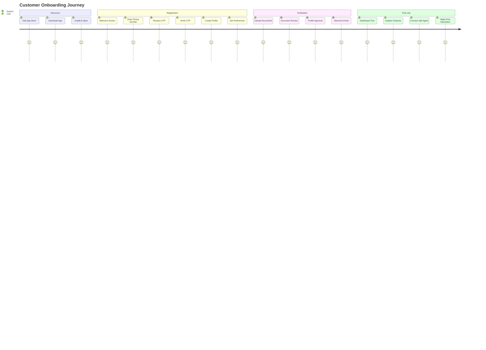
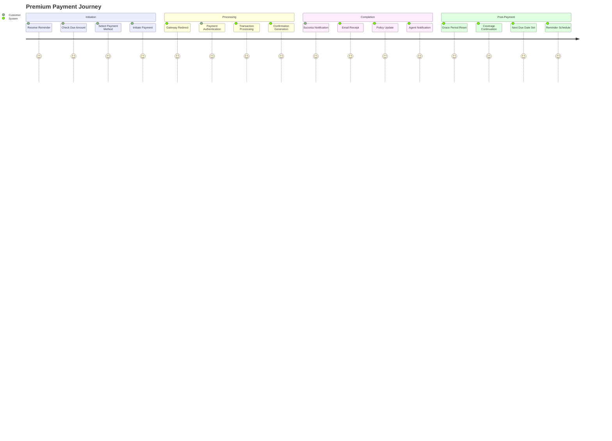
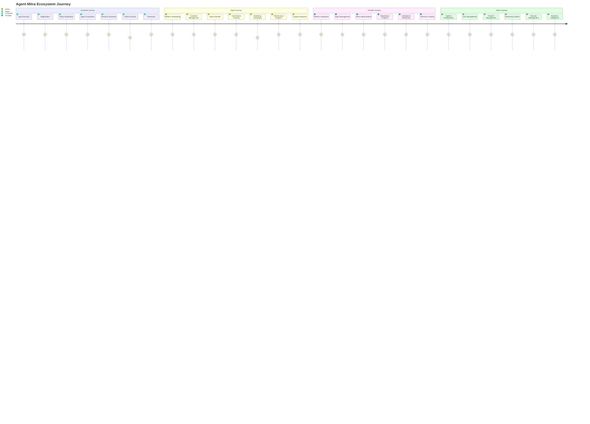

# Agent Mitra - Comprehensive Project Structure

> **Note:** This document follows the architectural principles outlined in the [Glossary](./glossary.md#separation-of-concerns), implementing Separation of Concerns across the mobile app, configuration portal, and LIC system integrations.

## 1. Repository Organization Overview

### 1.1 Root Directory Structure

```
agentmitra/
├── 📁 discovery/                 # Design & Documentation
│   ├── 📁 content/              # Core Architecture
│   ├── 📁 design/               # Technical Specifications
│   ├── 📁 deployment/           # Infrastructure & Deployment
│   └── 📁 miscellaneous/        # Business Documents
├── 📱 lib/                      # Flutter Mobile App
├── 📦 android/                  # Android Platform Code
├── 🍎 ios/                      # iOS Platform Code
├── 🌐 web/                      # Web Platform (Future)
├── 🪟 windows/                  # Windows Platform (Future)
├── 🐧 linux/                    # Linux Platform (Future)
├── 🥧 macos/                    # macOS Platform (Future)
├── 💼 config-portal/            # Agent Configuration Web Portal
│   ├── 🎨 frontend/              # React/Angular Web App
│   ├── 🔧 backend/               # Node.js/Express API
│   ├── 📊 data-import/           # Excel Processing Service
│   └── 🗃️ database/              # Portal Database Schema
├── 🔧 scripts/                  # Build & Deployment Scripts
├── 📊 docs/                     # Generated Documentation
├── 🧪 test/                     # Flutter Tests
├── 📋 pubspec.yaml              # Flutter Dependencies
├── 🐍 backend/                  # Python Backend (Alternative)
├── 🐳 docker/                   # Container Configurations
├── 🔒 .github/                  # GitHub Actions & Templates
├── 📝 README.md                 # Project Documentation
├── 📋 CHANGELOG.md              # Version History
├── 🔐 .env.example              # Environment Variables Template
├── 🛠️ Makefile                  # Development Commands
├── 🐳 docker-compose.yml         # Local Nginx service
├── 🔍 verify-local-services.sh   # Local services verification
├── 🗃️ setup-database-flyway.sh   # Flyway database setup
├── 🚀 setup-local-environment.sh # One-click development setup
├── 🌐 nginx.conf                 # Nginx configuration
├── 🗃️ flyway.conf                # Flyway configuration
├── 🗂️ db/migration/               # Database migration scripts
│   ├── 🗂️ V1__Create_shared_schema.sql
│   ├── 🗂️ V2__Create_tenant_schemas.sql
│   └── 🗂️ V3__Create_lic_schema_tables.sql
└── 🔐 .env.local                 # Local environment variables
```

### 1.2 Development Environment Setup

#### Local Development Structure
```
development/
├── 🐘 PostgreSQL 16              # Native MacBook service (Port 5432)
├── 🔴 Redis 7                    # Native MacBook service (Port 6379)
├── 🐳 docker-compose.yml         # Nginx service orchestration
├── 🟢 nginx.conf                 # Nginx reverse proxy config
├── 📁 flutter-hot-reload/        # Flutter development cache
├── 🐍 python-venv/                # Python virtual environment
├── 🗃️ flyway.conf                # Database migration config
├── 🗂️ db/migration/              # Flyway migration scripts
├── 🔍 verify-local-services.sh   # Service verification script
├── 🗃️ setup-database-flyway.sh   # Database setup script
├── 🚀 setup-local-environment.sh # One-click setup script
└── 🔐 .env.local                 # Local environment variables
```

## 2. Flutter Mobile Application Structure

### 2.1 Core Application Architecture

#### Main Application Structure
```
lib/
├── 🏠 main.dart                     # Application Entry Point
├── 🎨 core/                         # Core Application Logic
│   ├── 🏗️ architecture/            # Architecture Patterns
│   ├── 🔧 services/                # Business Logic Services
│   ├── 📦 repositories/            # Data Access Layer
│   ├── 🎯 utils/                   # Utility Functions
│   └── 🧩 widgets/                 # Shared UI Components
├── 📱 features/                    # Feature Modules
│   ├── 🔐 auth/                    # Authentication
│   ├── 👤 profile/                 # User Profile
│   ├── 📋 policies/                # Insurance Policies
│   ├── 💳 payments/                # Payment Processing
│   ├── 💬 chat/                    # Chat & Communication
│   ├── 📢 presentations/           # Presentation Carousel & Editor
│   ├── 📊 dashboard/               # Analytics Dashboard
│   ├── 🎥 tutorials/               # Video Tutorials
│   └── 🔔 notifications/           # Push Notifications
├── 🔧 shared/                      # Shared Resources
│   ├── 🎨 theme/                   # Theme & Styling
│   ├── 🌐 l10n/                    # Localization
│   ├── 🖼️ assets/                  # Static Assets
│   └── 🔗 constants/               # Application Constants
├── 🧪 test/                        # Unit & Widget Tests
└── 🔌 integration_test/            # Integration Tests
```

#### Detailed Core Structure
```
lib/core/
├── 🏗️ architecture/
│   ├── 🏛️ base/                     # Base Classes & Interfaces
│   │   ├── 🏗️ base_viewmodel.dart   # Base ViewModel
│   │   ├── 🏗️ base_repository.dart  # Base Repository
│   │   └── 🏗️ base_service.dart     # Base Service
│   ├── 🏗️ patterns/                # Design Patterns
│   │   ├── 🏗️ singleton.dart       # Singleton Pattern
│   │   ├── 🏗️ factory.dart         # Factory Pattern
│   │   └── 🏗️ observer.dart        # Observer Pattern
│   └── 🏗️ exceptions/              # Custom Exceptions
├── 🔧 services/
│   ├── 🔐 auth_service.dart        # Authentication Service
│   ├── 🌐 api_service.dart         # HTTP Client Service
│   ├── 💾 storage_service.dart     # Local Storage Service
│   ├── 🔔 notification_service.dart # Push Notifications
│   ├── 📱 device_service.dart      # Device Information
│   └── 📊 analytics_service.dart   # Analytics Tracking
├── 📦 repositories/
│   ├── 👤 user_repository.dart     # User Data Access
│   ├── 📋 policy_repository.dart   # Policy Data Access
│   ├── 💳 payment_repository.dart  # Payment Data Access
│   ├── 💬 chat_repository.dart     # Chat Data Access
│   └── 📊 analytics_repository.dart # Analytics Data Access
├── 🎯 utils/
│   ├── 🔧 validators.dart          # Input Validation
│   ├── 📅 date_utils.dart          # Date Formatting
│   ├── 💰 currency_utils.dart      # Currency Formatting
│   ├── 📞 phone_utils.dart         # Phone Number Handling
│   ├── 🖼️ image_utils.dart         # Image Processing
│   └── 🔒 encryption_utils.dart    # Data Encryption
└── 🧩 widgets/
    ├── 🎨 themed/                  # Themed Components
    │   ├── 🎨 themed_button.dart   # Custom Button
    │   ├── 🎨 themed_text_field.dart # Custom Text Field
    │   └── 🎨 themed_card.dart     # Custom Card
    ├── 📝 forms/                   # Form Components
    │   ├── 📝 login_form.dart      # Login Form
    │   ├── 📝 registration_form.dart # Registration Form
    │   └── 📝 payment_form.dart    # Payment Form
    └── 📱 layout/                  # Layout Components
        ├── 📱 app_bar.dart         # Custom App Bar
        ├── 📱 bottom_nav.dart      # Bottom Navigation
        └── 📱 drawer.dart          # Navigation Drawer
```

### 2.2 Feature-Based Module Structure

#### Authentication Feature
```
lib/features/auth/
├── 📱 presentation/
│   ├── 📱 pages/
│   │   ├── 📱 login_page.dart      # Login Screen
│   │   ├── 📱 register_page.dart   # Registration Screen
│   │   ├── 📱 forgot_password_page.dart # Password Reset
│   │   └── 📱 otp_verification_page.dart # OTP Verification
│   ├── 🧩 widgets/
│   │   ├── 🧩 login_form.dart      # Login Form Widget
│   │   ├── 🧩 register_form.dart   # Registration Form
│   │   ├── 🧩 biometric_button.dart # Biometric Login
│   │   └── 🧩 otp_input.dart       # OTP Input Field
│   └── 🏗️ viewmodels/
│       ├── 🏗️ login_viewmodel.dart # Login Logic
│       └── 🏗️ register_viewmodel.dart # Registration Logic
├── 💾 data/
│   ├── 💾 models/
│   │   ├── 💾 user_model.dart      # User Data Model
│   │   └── 💾 auth_response.dart   # Auth API Response
│   ├── 💾 repositories/
│   │   └── 💾 auth_repository.dart # Auth Data Access
│   └── 💾 datasources/
│       ├── 💾 auth_remote_datasource.dart # API Calls
│       └── 💾 auth_local_datasource.dart  # Local Storage
└── 🧪 test/
    ├── 🧪 unit/                    # Unit Tests
    ├── 🧪 widget/                  # Widget Tests
    └── 🧪 integration/             # Integration Tests
```

#### Policy Management Feature
```
lib/features/policies/
├── 📱 presentation/
│   ├── 📱 pages/
│   │   ├── 📱 policies_list_page.dart    # Policies List
│   │   ├── 📱 policy_detail_page.dart    # Policy Details
│   │   ├── 📱 policy_search_page.dart    # Search Policies
│   │   └── 📱 policy_add_page.dart       # Add New Policy
│   ├── 🧩 widgets/
│   │   ├── 🧩 policy_card.dart           # Policy Card
│   │   ├── 🧩 policy_status_badge.dart   # Status Indicator
│   │   ├── 🧩 policy_filter.dart         # Filter Options
│   │   └── 🧩 premium_calculator.dart    # Calculator Widget
│   └── 🏗️ viewmodels/
│       ├── 🏗️ policies_viewmodel.dart    # Policies List Logic
│       └── 🏗️ policy_detail_viewmodel.dart # Policy Detail Logic
├── 💾 data/
│   ├── 💾 models/
│   │   ├── 💾 policy_model.dart          # Policy Data Model
│   │   ├── 💾 premium_model.dart         # Premium Data Model
│   │   └── 💾 coverage_model.dart        # Coverage Data Model
│   ├── 💾 repositories/
│   │   └── 💾 policy_repository.dart     # Policy Data Access
│   └── 💾 datasources/
│       ├── 💾 policy_remote_datasource.dart # API Calls
│       └── 💾 policy_local_datasource.dart  # Cache
└── 🧪 test/
    ├── 🧪 unit/
    ├── 🧪 widget/
    └── 🧪 integration/
```

#### Payment Processing Feature
```
lib/features/payments/
├── 📱 presentation/
│   ├── 📱 pages/
│   │   ├── 📱 payment_methods_page.dart  # Payment Methods
│   │   ├── 📱 payment_history_page.dart  # Payment History
│   │   ├── 📱 premium_payment_page.dart  # Make Payment
│   │   └── 📱 payment_success_page.dart  # Payment Confirmation
│   ├── 🧩 widgets/
│   │   ├── 🧩 payment_card.dart          # Payment Method Card
│   │   ├── 🧩 amount_input.dart          # Amount Input
│   │   ├── 🧩 payment_gateway_selector.dart # Gateway Selection
│   │   └── 🧩 payment_receipt.dart       # Payment Receipt
│   └── 🏗️ viewmodels/
│       ├── 🏗️ payments_viewmodel.dart    # Payments Logic
│       └── 🏗️ payment_processing_viewmodel.dart # Processing Logic
├── 💾 data/
│   ├── 💾 models/
│   │   ├── 💾 payment_model.dart         # Payment Data Model
│   │   ├── 💾 transaction_model.dart     # Transaction Data
│   │   └── 💾 gateway_model.dart         # Payment Gateway
│   ├── 💾 repositories/
│   │   └── 💾 payment_repository.dart    # Payment Data Access
│   └── 💾 datasources/
│       ├── 💾 payment_remote_datasource.dart # Gateway APIs
│       └── 💾 payment_local_datasource.dart  # Local Cache
└── 🧪 test/
    ├── 🧪 unit/
    ├── 🧪 widget/
    └── 🧪 integration/
```

#### Chatbot & Communication Feature
```
lib/features/chat/
├── 📱 presentation/
│   ├── 📱 pages/
│   │   ├── 📱 chat_page.dart             # Main Chat Interface
│   │   ├── 📱 chatbot_history_page.dart  # Chat History
│   │   ├── 📱 agent_callback_page.dart   # Callback Request
│   │   └── 📱 whatsapp_redirect_page.dart # WhatsApp Redirect
│   ├── 🧩 widgets/
│   │   ├── 🧩 chat_bubble.dart           # Message Bubble
│   │   ├── 🧩 typing_indicator.dart      # Typing Animation
│   │   ├── 🧩 quick_replies.dart         # Quick Reply Buttons
│   │   └── 🧩 chat_input.dart            # Message Input
│   └── 🏗️ viewmodels/
│       ├── 🏗️ chat_viewmodel.dart        # Chat Logic
│       └── 🏗️ chatbot_viewmodel.dart     # AI Chatbot Logic
├── 💾 data/
│   ├── 💾 models/
│   │   ├── 💾 message_model.dart         # Chat Message
│   │   ├── 💾 conversation_model.dart    # Conversation
│   │   └── 💾 callback_model.dart        # Callback Request
│   ├── 💾 repositories/
│   │   └── 💾 chat_repository.dart       # Chat Data Access
│   └── 💾 datasources/
│       ├── 💾 chat_remote_datasource.dart # Chat APIs
│       └── 💾 chat_local_datasource.dart  # Local Cache
└── 🧪 test/
    ├── 🧪 unit/
    ├── 🧪 widget/
    └── 🧪 integration/
```

#### Presentation Carousel Feature
```
lib/features/presentations/
├── 📱 presentation/
│   ├── 📱 widgets/
│   │   ├── 📱 presentation_carousel.dart      # Main carousel widget
│   │   ├── 📱 slide_view.dart                 # Individual slide renderer
│   │   ├── 📱 slide_image_view.dart           # Image slide widget
│   │   ├── 📱 slide_video_view.dart           # Video slide widget
│   │   └── 📱 slide_text_overlay.dart         # Text overlay widget
│   ├── 📱 pages/
│   │   ├── 📱 presentations_list_page.dart    # Presentations library
│   │   └── 📱 presentation_preview_page.dart     # Full-screen preview
│   └── 🏗️ viewmodels/
│       └── 🏗️ presentation_viewmodel.dart     # Carousel logic
├── ✏️ editor/
│   ├── 📱 pages/
│   │   ├── 📱 presentation_editor_page.dart    # Main editor screen
│   │   ├── 📱 slide_editor_page.dart           # Individual slide editor
│   │   └── 📱 template_selector_page.dart      # Template selection
│   ├── 🧩 widgets/
│   │   ├── 🧩 slide_list_view.dart             # Reorderable slide list
│   │   ├── 🧩 media_picker_widget.dart         # Image/video picker
│   │   ├── 🧩 text_editor_widget.dart          # Rich text editor
│   │   ├── 🧩 layout_selector_widget.dart     # Layout options
│   │   ├── 🧩 color_picker_widget.dart         # Color selection
│   │   └── 🧩 preview_widget.dart             # Live preview
│   └── 🏗️ viewmodels/
│       ├── 🏗️ presentation_editor_viewmodel.dart
│       └── 🏗️ slide_editor_viewmodel.dart
├── 💾 data/
│   ├── 💾 models/
│   │   ├── 💾 slide_model.dart                 # Slide data model
│   │   ├── 💾 presentation_model.dart          # Presentation model
│   │   └── 💾 template_model.dart              # Template model
│   ├── 💾 repositories/
│   │   └── 💾 presentation_repository.dart     # Data access layer
│   └── 💾 datasources/
│       ├── 💾 presentation_remote_datasource.dart # API calls
│       └── 💾 presentation_local_datasource.dart   # Hive cache
├── 🔧 services/
│   ├── 🔧 presentation_service.dart            # API service
│   ├── 🔧 presentation_cache_service.dart      # Local cache
│   └── 🔧 media_upload_service.dart            # Media upload
└── 🧪 test/
    ├── 🧪 unit/
    ├── 🧪 widget/
    └── 🧪 integration/
```

### 2.3 Shared Resources Structure

#### Theme & Styling
```
lib/shared/theme/
├── 🎨 app_theme.dart              # Main Theme Configuration
├── 🎨 colors.dart                 # Color Palette
├── 🎨 typography.dart             # Text Styles
├── 🎨 spacing.dart                # Spacing Constants
├── 🎨 shadows.dart                # Shadow Definitions
├── 🎨 borders.dart                # Border Radius & Styles
└── 🎨 animations.dart             # Animation Constants
```

#### Localization
```
lib/shared/l10n/
├── 🌐 app_localizations.dart      # Localization Delegate
├── 🌐 app_localizations_en.dart   # English Translations
├── 🌐 app_localizations_hi.dart   # Hindi Translations
├── 🌐 app_localizations_te.dart   # Telugu Translations
├── 🔧 localization_service.dart   # CDN Localization Service
└── 📁 arb/                        # ARB Files (CDN Fallback)
```

#### Assets & Resources
```
assets/
├── 🖼️ images/
│   ├── 🖼️ logos/
│   │   ├── 🖼️ agent_mitra_logo.png
│   │   └── 🖼️ agent_mitra_icon.png
│   ├── 🖼️ icons/
│   │   ├── 🖼️ policy_icons/
│   │   ├── 🖼️ payment_icons/
│   │   └── 🖼️ chat_icons/
│   └── 🖼️ illustrations/
│       ├── 🖼️ onboarding/
│       └── 🖼️ empty_states/
├── 🎥 videos/
│   ├── 🎥 tutorials/
│   └── 🎥 onboarding/
├── 📁 fonts/
│   ├── 📁 roboto/
│   └── 📁 noto_sans/
└── 📋 animations/
    ├── 📋 lottie/
    └── 📋 rive/
```

#### Constants & Configuration
```
lib/shared/constants/
├── 🔗 api_constants.dart          # API Endpoints
├── 🎯 app_constants.dart          # App-wide Constants
├── 📊 analytics_constants.dart    # Analytics Events
├── 💬 chat_constants.dart         # Chat Configuration
├── 📢 presentation_constants.dart  # Presentation Configuration
├── 💰 payment_constants.dart      # Payment Settings
├── 🌐 localization_constants.dart # Language Settings
└── 🔧 feature_flags.dart          # Feature Toggle Constants
```

## 3. Python Backend Structure (Alternative Architecture)

### 3.1 Backend Application Structure

#### Main Backend Architecture
```
backend/
├── 🏠 main.py                     # FastAPI Application
├── 🎨 core/                       # Core Backend Logic
│   ├── 🔧 config.py               # Configuration Management
│   ├── 🔐 security.py             # Authentication & Security
│   ├── 💾 database.py             # Database Connection
│   ├── 📊 logging.py              # Logging Configuration
│   ├── 📊 monitoring.py           # Monitoring & Metrics
│   └── 🎯 tasks.py                # Background Tasks
├── 📱 api/                        # API Layer
│   ├── 🏠 v1/                     # API Version 1
│   │   ├── 🏠 __init__.py         # API Router
│   │   ├── 🔐 auth.py             # Authentication Endpoints
│   │   ├── 👤 users.py            # User Management
│   │   ├── 📋 policies.py         # Policy Management
│   │   ├── 💳 payments.py         # Payment Processing
│   │   ├── 💬 chat.py             # Chat & Communication
│   │   ├── 📢 presentations.py   # Presentation Management
│   │   ├── 📊 analytics.py        # Analytics & Reporting
│   │   ├── 🎥 content.py          # Content Management
│   │   └── 🤖 chatbot.py          # AI Chatbot
│   └── 🏠 v2/                     # API Version 2 (Future)
├── 💾 models/                     # Database Models
│   ├── 👤 user.py                 # User Models
│   ├── 📋 policy.py               # Policy Models
│   ├── 💳 payment.py              # Payment Models
│   ├── 💬 chat.py                 # Chat Models
│   ├── 📢 presentations.py        # Presentation Models
│   ├── 📊 analytics.py            # Analytics Models
│   └── 🎥 content.py              # Content Models
├── 🔧 services/                   # Business Logic
│   ├── 🔐 auth_service.py         # Authentication Service
│   ├── 💳 payment_service.py      # Payment Processing
│   ├── 💬 chat_service.py         # Chat Service
│   ├── 🤖 chatbot_service.py      # AI Chatbot Service
│   ├── 📢 presentation_service.py # Presentation Service
│   ├── 📧 email_service.py        # Email Service
│   ├── 📱 sms_service.py          # SMS Service
│   └── 📊 analytics_service.py    # Analytics Service
├── 📦 repositories/               # Data Access Layer
│   ├── 👤 user_repository.py      # User Data Access
│   ├── 📋 policy_repository.py    # Policy Data Access
│   ├── 💳 payment_repository.py   # Payment Data Access
│   ├── 💬 chat_repository.py      # Chat Data Access
│   ├── 📢 presentation_repository.py # Presentation Data Access
│   └── 📊 analytics_repository.py # Analytics Data Access
├── 🧪 tests/                      # Test Suite
│   ├── 🧪 unit/                   # Unit Tests
│   ├── 🧪 integration/            # Integration Tests
│   ├── 🧪 e2e/                    # End-to-End Tests
│   └── 🧪 conftest.py             # Test Configuration
├── 📋 scripts/                    # Utility Scripts
│   ├── 📋 migrate.py              # Database Migration
│   ├── 📋 seed.py                 # Data Seeding
│   └── 📋 backup.py               # Backup Scripts
├── 📁 templates/                  # Email Templates
│   ├── 📧 auth/
│   ├── 📧 payments/
│   └── 📧 notifications/
├── 📊 docs/                       # API Documentation
└── 🐳 docker/                     # Container Configuration
```

#### Detailed Service Layer
```
backend/services/
├── 🔐 auth_service.py
│   ├── JWT token management
│   ├── Password hashing & validation
│   ├── MFA implementation
│   ├── Session management
│   └── Role-based permissions
├── 💳 payment_service.py
│   ├── Razorpay integration
│   ├── Stripe integration
│   ├── Payment validation
│   ├── Refund processing
│   └── Reconciliation
├── 💬 chat_service.py
│   ├── Real-time messaging
│   ├── Message encryption
│   ├── File attachments
│   └── Message history
├── 🤖 chatbot_service.py
│   ├── OpenAI integration
│   ├── Intent recognition
│   ├── Knowledge base search
│   ├── Response generation
│   └── Escalation handling
├── 📧 email_service.py
│   ├── SendGrid integration
│   ├── Template rendering
│   ├── Bulk sending
│   └── Delivery tracking
├── 📱 sms_service.py
│   ├── Twilio integration
│   ├── OTP sending
│   ├── Bulk SMS
│   └── Delivery confirmation
└── 📊 analytics_service.py
    ├── Event tracking
    ├── Metric calculation
    ├── Report generation
    └── Dashboard data
```

### 3.2 Database Layer Structure

#### SQLAlchemy Models Organization
```
backend/models/
├── 🏗️ base.py                     # Base Model Classes
├── 👤 user.py
│   ├── User model
│   ├── UserSession model
│   ├── UserPermission model
│   └── Role model
├── 📋 policy.py
│   ├── InsurancePolicy model
│   ├── Policyholder model
│   ├── Agent model
│   └── Provider model
├── 💳 payment.py
│   ├── PremiumPayment model
│   ├── PaymentMethod model
│   ├── Transaction model
│   └── Refund model
├── 💬 chat.py
│   ├── ChatbotSession model
│   ├── ChatMessage model
│   ├── WhatsAppMessage model
│   └── Conversation model
├── 📢 presentations.py
│   ├── Presentation model
│   ├── Slide model
│   ├── PresentationTemplate model
│   └── MediaUpload model
├── 📊 analytics.py
│   ├── UserEvent model
│   ├── UserJourney model
│   ├── AgentPerformance model
│   └── SystemMetric model
└── 🎥 content.py
    ├── VideoContent model
    ├── VideoAnalytics model
    └── KnowledgeBase model
```

## 4. Infrastructure & DevOps Structure

### 4.1 Containerization & Orchestration

#### Docker Configuration
```
docker/
├── 🐳 Dockerfile                  # Main Application
├── 🐳 Dockerfile.backend          # Backend Service
├── 🐳 Dockerfile.worker           # Background Worker
├── 🐳 docker-compose.yml          # Local Development
├── 🐳 docker-compose.prod.yml     # Production Stack
└── 🐳 nginx/
    ├── 🐳 nginx.conf              # Reverse Proxy Config
    └── 🐳 ssl/                    # SSL Certificates
```

#### Kubernetes Manifests
```
k8s/
├── 📁 base/                       # Base Configurations
│   ├── 📁 configmaps/             # Configuration Maps
│   ├── 📁 secrets/                # Secret Management
│   └── 📁 services/               # Service Definitions
├── 📁 overlays/                   # Environment Overlays
│   ├── 📁 development/            # Dev Environment
│   ├── 📁 staging/                # Staging Environment
│   └── 📁 production/             # Production Environment
├── 📁 monitoring/                 # Monitoring Stack
│   ├── 📁 prometheus/             # Metrics Collection
│   ├── 📁 grafana/                # Dashboard Configuration
│   └── 📁 alertmanager/           # Alert Management
└── 📁 ci/                         # CI/CD Pipeline Config
    ├── 📁 github-actions/         # GitHub Actions Workflows
    └── 📁 argocd/                 # GitOps Configuration
```

### 4.2 CI/CD Pipeline Structure

#### GitHub Actions Workflows
```
.github/
├── 📋 workflows/
│   ├── 📋 ci.yml                  # Continuous Integration
│   ├── 📋 cd.yml                  # Continuous Deployment
│   ├── 📋 security.yml            # Security Scanning
│   ├── 📋 performance.yml         # Performance Testing
│   └── 📋 release.yml             # Release Management
├── 📋 ISSUE_TEMPLATE/
│   ├── 📋 bug_report.md           # Bug Report Template
│   ├── 📋 feature_request.md      # Feature Request Template
│   └── 📋 security_report.md      # Security Issue Template
└── 📋 PULL_REQUEST_TEMPLATE.md    # PR Template
```

#### Build & Release Scripts
```
scripts/
├── 🏗️ build/
│   ├── 🏗️ build_android.sh        # Android Build Script
│   ├── 🏗️ build_ios.sh            # iOS Build Script
│   ├── 🏗️ build_web.sh            # Web Build Script
│   └── 🏗️ build_docker.sh         # Docker Build Script
├── 🚀 deploy/
│   ├── 🚀 deploy_dev.sh           # Development Deployment
│   ├── 🚀 deploy_staging.sh       # Staging Deployment
│   ├── 🚀 deploy_prod.sh          # Production Deployment
│   └── 🚀 rollback.sh             # Rollback Script
├── 🔍 test/
│   ├── 🔍 run_unit_tests.sh       # Unit Test Runner
│   ├── 🔍 run_integration_tests.sh # Integration Tests
│   ├── 🔍 run_e2e_tests.sh        # End-to-End Tests
│   └── 🔍 performance_test.sh     # Performance Tests
└── 🛠️ maintenance/
    ├── 🛠️ backup_database.sh      # Database Backup
    ├── 🛠️ cleanup_logs.sh         # Log Cleanup
    ├── 🛠️ update_dependencies.sh  # Dependency Updates
    └── 🛠️ health_check.sh         # Health Monitoring
```

## 5. Testing Structure

### 5.1 Flutter Testing Structure

#### Unit & Widget Tests
```
test/
├── 🧪 core/                       # Core Logic Tests
│   ├── 🧪 services/               # Service Layer Tests
│   ├── 🧪 repositories/           # Repository Tests
│   └── 🧪 utils/                  # Utility Function Tests
├── 🧪 features/                   # Feature Tests
│   ├── 🧪 auth/                   # Authentication Tests
│   ├── 🧪 policies/               # Policy Tests
│   ├── 🧪 payments/               # Payment Tests
│   └── 🧪 chat/                   # Chat Tests
├── 🧪 widgets/                    # Widget Tests
│   ├── 🧪 themed/                 # Themed Widget Tests
│   ├── 🧪 forms/                  # Form Widget Tests
│   └── 🧪 layout/                 # Layout Widget Tests
├── 🧪 mocks/                      # Test Mocks & Fixtures
│   ├── 🧪 api_mocks.dart          # API Response Mocks
│   ├── 🧪 model_mocks.dart        # Data Model Mocks
│   └── 🧪 service_mocks.dart      # Service Mocks
└── 🧪 test_utils/                 # Test Utilities
    ├── 🧪 test_helpers.dart       # Test Helper Functions
    ├── 🧪 widget_testers.dart     # Widget Testing Utils
    └── 🧪 mock_factories.dart     # Mock Data Factories
```

#### Integration Tests
```
integration_test/
├── 🧪 app_test.dart               # Full App Integration
├── 🧪 auth_flow_test.dart         # Authentication Flow
├── 🧪 policy_management_test.dart # Policy CRUD Flow
├── 🧪 payment_flow_test.dart      # Payment Processing
├── 🧪 chat_flow_test.dart         # Chat Functionality
└── 🧪 onboarding_test.dart       # User Onboarding
```

### 5.2 Backend Testing Structure

#### Python Test Organization
```
backend/tests/
├── 🧪 unit/                       # Unit Tests
│   ├── 🧪 test_auth.py            # Authentication Tests
│   ├── 🧪 test_policies.py        # Policy Tests
│   ├── 🧪 test_payments.py        # Payment Tests
│   └── 🧪 test_chatbot.py         # Chatbot Tests
├── 🧪 integration/                # Integration Tests
│   ├── 🧪 test_api_endpoints.py   # API Endpoint Tests
│   ├── 🧪 test_database.py        # Database Integration
│   └── 🧪 test_external_apis.py   # External API Tests
├── 🧪 e2e/                        # End-to-End Tests
│   ├── 🧪 test_user_journey.py    # User Journey Tests
│   ├── 🧪 test_payment_flow.py    # Payment Flow Tests
│   └── 🧪 test_admin_flow.py      # Admin Flow Tests
├── 🧪 fixtures/                   # Test Data Fixtures
│   ├── 🧪 users.json              # User Test Data
│   ├── 🧪 policies.json           # Policy Test Data
│   └── 🧪 payments.json           # Payment Test Data
└── 🧪 conftest.py                 # Test Configuration
```

## 6. Documentation Structure

### 6.1 Technical Documentation

#### API Documentation
```
docs/
├── 📚 api/
│   ├── 📚 v1/
│   │   ├── 📚 auth.md              # Authentication API
│   │   ├── 📚 users.md             # User Management API
│   │   ├── 📚 policies.md          # Policy Management API
│   │   ├── 📚 payments.md          # Payment API
│   │   ├── 📚 chat.md              # Chat API
│   │   └── 📚 analytics.md         # Analytics API
│   └── 📚 v2/                     # Future API Version
├── 🏗️ architecture/
│   ├── 🏗️ overview.md             # System Architecture
│   ├── 🏗️ database.md             # Database Design
│   ├── 🏗️ security.md             # Security Architecture
│   └── 🏗️ scalability.md          # Scalability Design
├── 🚀 deployment/
│   ├── 🚀 local_setup.md          # Local Development
│   ├── 🚀 aws_deployment.md       # AWS Deployment
│   ├── 🚀 ci_cd.md                # CI/CD Pipeline
│   └── 🚀 monitoring.md           # Monitoring Setup
├── 🧪 testing/
│   ├── 🧪 unit_testing.md         # Unit Testing Guide
│   ├── 🧪 integration_testing.md  # Integration Testing
│   ├── 🧪 e2e_testing.md          # E2E Testing Guide
│   └── 🧪 performance_testing.md  # Performance Testing
└── 🤝 development/
    ├── 🤝 coding_standards.md     # Coding Standards
    ├── 🤝 git_workflow.md         # Git Workflow
    ├── 🤝 code_review.md          # Code Review Process
    └── 🤝 release_process.md      # Release Process
```

### 6.2 User Documentation

#### User Guides
```
docs/user/
├── 👥 end_users/
│   ├── 👥 getting_started.md      # Getting Started Guide
│   ├── 👥 using_the_app.md        # App Usage Guide
│   ├── 👥 managing_policies.md    # Policy Management
│   ├── 👥 making_payments.md      # Payment Guide
│   └── 👥 troubleshooting.md      # Troubleshooting
├── 🧑‍💼 agents/
│   ├── 🧑‍💼 agent_onboarding.md   # Agent Setup Guide
│   ├── 🧑‍💼 customer_management.md # Customer Management
│   ├── 🧑‍💼 commission_tracking.md # Commission Tracking
│   ├── 🧑‍💼 marketing_tools.md     # Marketing Tools
│   └── 🧑‍💼 reporting.md          # Reports & Analytics
└── 👨‍💻 administrators/
    ├── 👨‍💻 admin_setup.md        # Admin Setup
    ├── 👨‍💻 user_management.md    # User Administration
    ├── 👨‍💻 system_configuration.md # System Config
    ├── 👨‍💻 monitoring.md         # System Monitoring
    └── 👨‍💻 security.md           # Security Management
```

## 7. Configuration Management

### 7.1 Environment Configuration

#### Environment Files Structure
```
config/
├── 🔧 environments/
│   ├── 🔧 development.env         # Development Settings
│   ├── 🔧 staging.env             # Staging Settings
│   ├── 🔧 production.env          # Production Settings
│   └── 🔧 local.env               # Local Development
├── 🔧 features/                   # Feature Flags
│   ├── 🔧 features.dev.json       # Development Features
│   ├── 🔧 features.staging.json   # Staging Features
│   └── 🔧 features.prod.json      # Production Features
├── 🔧 databases/                  # Database Configurations
│   ├── 🔧 postgres.conf           # PostgreSQL Config
│   └── 🔧 redis.conf              # Redis Config
└── 🔧 monitoring/                 # Monitoring Configurations
    ├── 🔧 prometheus.yml          # Prometheus Config
    ├── 🔧 grafana.ini             # Grafana Config
    └── 🔧 alerts.yml              # Alert Rules
```

#### Configuration Loading
```python
# config/settings.py
"""
Application Configuration Management
===================================

Centralized configuration loading with environment support.
"""

import os
import json
from pathlib import Path
from typing import Dict, Any, Optional
from pydantic import BaseSettings, Field

class AppSettings(BaseSettings):
    """Main application settings"""

    # Application
    app_name: str = Field(default="Agent Mitra")
    version: str = Field(default="0.0.1")
    debug: bool = Field(default=False)
    environment: str = Field(default="development")

    # Server
    host: str = Field(default="0.0.0.0")
    port: int = Field(default=8000)
    workers: int = Field(default=4)

    # Database
    database_url: str = Field(...)
    db_pool_size: int = Field(default=10)
    db_max_overflow: int = Field(default=20)

    # Redis
    redis_url: str = Field(default="redis://localhost:6379")
    redis_pool_size: int = Field(default=10)

    # Security
    jwt_secret_key: str = Field(...)
    jwt_refresh_secret_key: str = Field(...)
    jwt_algorithm: str = Field(default="HS256")
    jwt_access_token_expire_minutes: int = Field(default=30)
    jwt_refresh_token_expire_days: int = Field(default=7)

    # External APIs
    openai_api_key: str = Field(...)
    whatsapp_access_token: str = Field(...)
    razorpay_key_id: str = Field(...)
    sendgrid_api_key: str = Field(...)

    class Config:
        env_file = ".env"
        case_sensitive = False

# Load settings
settings = AppSettings()

# Feature flags
def load_feature_flags() -> Dict[str, Any]:
    """Load feature flags based on environment"""
    feature_file = Path(f"config/features/features.{settings.environment}.json")
    if feature_file.exists():
        with open(feature_file) as f:
            return json.load(f)
    return {}

feature_flags = load_feature_flags()
```

## 8. User Journey Flow Diagrams

### 8.1 Customer Onboarding Journey

#### New Customer Registration Flow


#### Policy Purchase Journey


### 8.2 Agent Onboarding & Daily Workflow

#### Agent Onboarding Journey


#### Agent Daily Workflow


### 8.3 Payment Processing Journey

#### Premium Payment Flow


### 8.4 Support & Escalation Journey

#### Customer Support Journey


### 8.5 Complete User Ecosystem Journey

#### Multi-User Ecosystem Flow


This comprehensive project structure provides a solid foundation for the Agent Mitra platform, ensuring scalability, maintainability, and developer productivity across Flutter mobile, Python backend, and infrastructure components.
