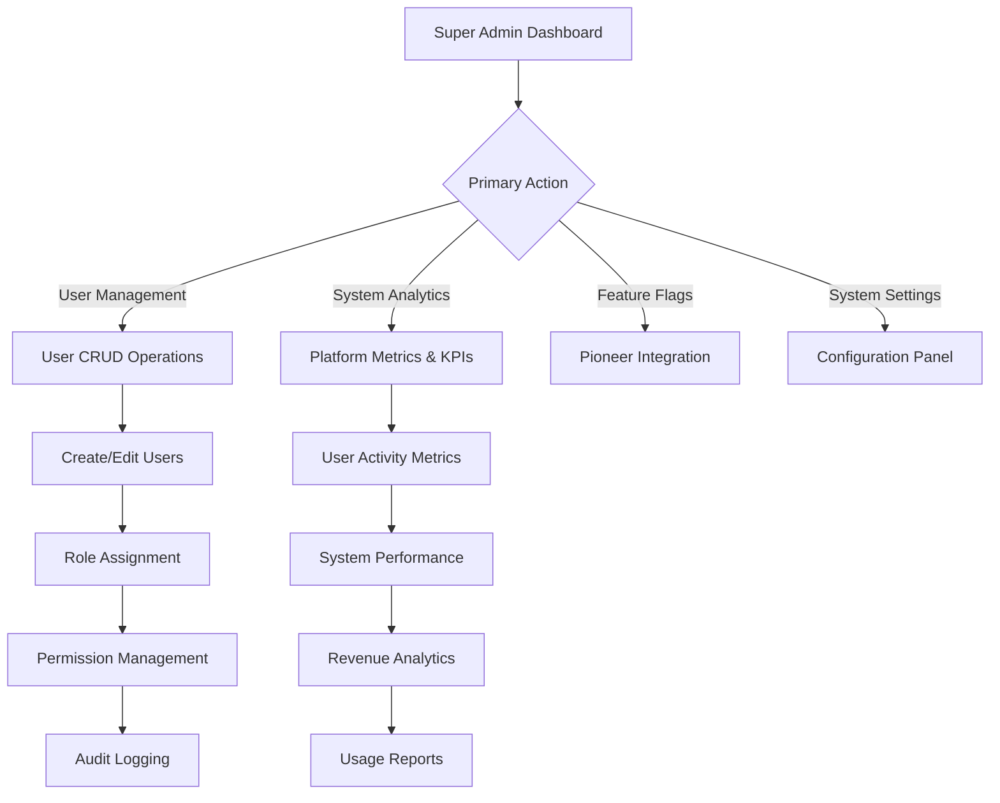
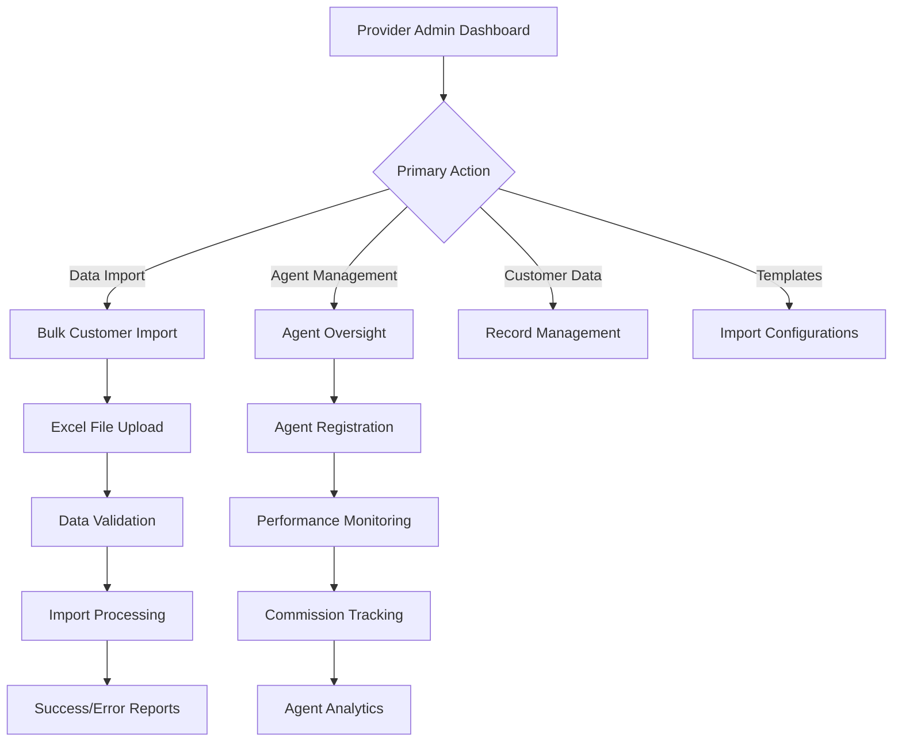
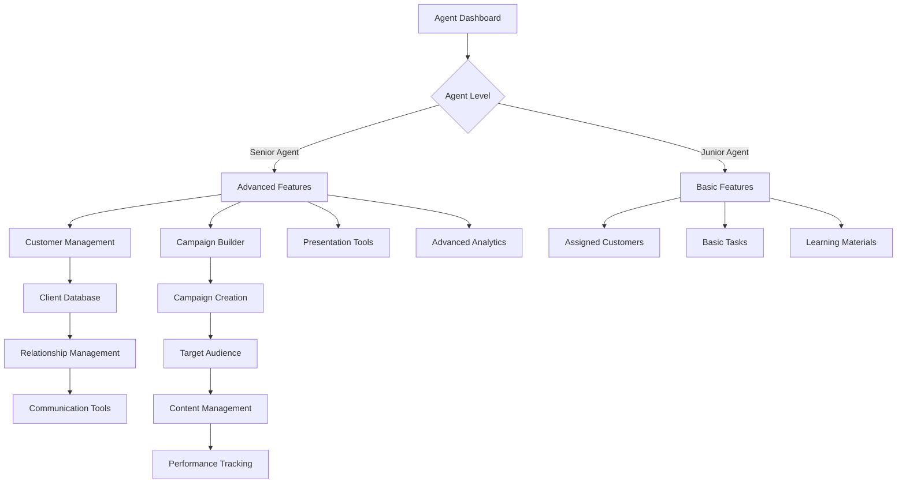
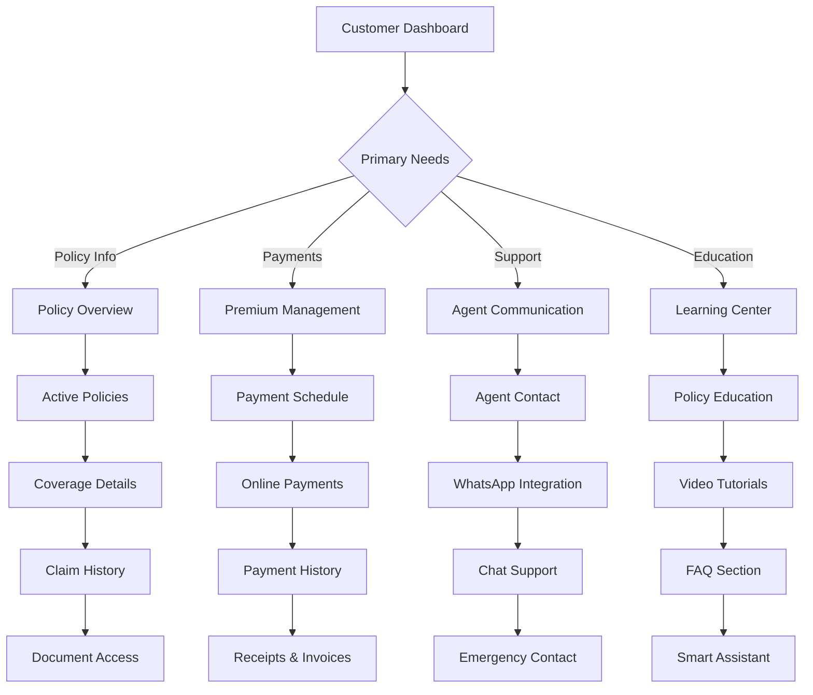

# Agent Mitra - Role-Based Navigation & User Journey System

## Overview

This document outlines the comprehensive role-based navigation system and user journeys implemented in the Agent Mitra application. The system provides tailored experiences for each user role with appropriate access controls, navigation structures, and feature availability.

## User Roles & Access Levels

### 1. Super Admin (`super_admin`)
**Phone:** +919876543200 | **Permissions:** 59 | **Access:** Full System
- **Primary Dashboard:** `/super-admin-dashboard`
- **Purpose:** Complete platform administration and oversight

### 2. Provider Admin (`insurance_provider_admin`)
**Phone:** +919876543201 | **Permissions:** Provider Management
- **Primary Dashboard:** `/provider-admin-dashboard`
- **Purpose:** Insurance provider operations and agent management

### 3. Regional Manager (`regional_manager`)
**Phone:** +919876543202 | **Permissions:** 19 | **Access:** Regional Operations
- **Primary Dashboard:** `/regional-manager-dashboard`
- **Purpose:** Regional team management and performance oversight

### 4. Senior Agent (`senior_agent`)
**Phone:** +919876543203 | **Permissions:** 16 | **Access:** Advanced Agent Operations
- **Primary Dashboard:** `/senior-agent-dashboard`
- **Purpose:** Advanced customer management and business analytics

### 5. Junior Agent (`junior_agent`)
**Phone:** +919876543204 | **Permissions:** 7 | **Access:** Basic Agent Operations
- **Primary Dashboard:** `/agent-dashboard` (existing)
- **Purpose:** Basic customer operations and task management

### 6. Policyholder (`policyholder`)
**Phone:** +919876543205 | **Permissions:** 5 | **Access:** Customer Portal
- **Primary Dashboard:** `/customer-dashboard`
- **Purpose:** Policy management and agent communication

### 7. Support Staff (`support_staff`)
**Phone:** +919876543206 | **Permissions:** 8 | **Access:** Customer Support
- **Primary Dashboard:** `/callback-management`
- **Purpose:** Customer service and technical support

## Navigation Architecture

### Primary Navigation Structure

Each role has a customized navigation experience:

#### Super Admin Navigation
```
🏠 Dashboard (Overview)
├── 👥 User Management (Full CRUD)
├── 📊 System Analytics (Platform metrics)
├── ⚙️ Feature Flags (Pioneer integration)
└── 🔧 System Settings (Configuration)
```

#### Provider Admin Navigation
```
🏠 Dashboard (Provider Overview)
├── 📤 Data Import (Bulk operations)
├── 👥 Agent Management (Provider agents)
├── 👤 Customer Data (Records management)
├── 📋 Templates (Import configurations)
└── 📊 Reports (Provider analytics)
```

#### Regional Manager Navigation
```
🏠 Dashboard (Regional Overview)
├── 📊 Team Analytics (Agent performance)
├── 👥 Agent Management (Regional agents)
├── 📢 Campaign Performance (Marketing ROI)
└── 📊 Reports (Regional metrics)
```

#### Senior Agent Navigation
```
🏠 Dashboard (Business Overview)
├── 💼 My Business (Personal analytics)
├── 👥 Customers (Client management)
├── 📢 Campaigns (Marketing tools)
├── 📽️ Presentations (Sales materials)
├── 📊 Analytics (ROI tracking)
├── 💬 Daily Quotes (Content tools)
└── ⚙️ Settings (Business preferences)
```

#### Junior Agent Navigation
```
🏠 Dashboard (Task Overview)
├── 👥 My Customers (Assigned clients)
├── 📊 Performance (Basic metrics)
├── 📝 Tasks (Daily activities)
└── 📚 Learning (Training materials)
```

#### Policyholder Navigation
```
🏠 Dashboard (Policy Overview)
├── 📄 My Policies (Active policies)
├── 💳 Payments (Premium management)
├── 💬 Agent Communication (Support chat)
├── 🤖 Smart Assistant (AI help)
├── 📚 Learning Center (Policy education)
└── ⚙️ Settings (Preferences)
```

#### Support Staff Navigation
```
🏠 Dashboard (Support Overview)
├── 📞 Callback Management (Scheduled calls)
├── 🎫 Ticket System (Issue tracking)
├── 👥 Customer Support (User assistance)
├── 📊 Support Analytics (Performance metrics)
└── 📚 Knowledge Base (Support resources)
```

## User Journey Flows

### Authentication & Onboarding Flow (All Roles)

```mermaid
graph TD
    A[Splash Screen] --> B{User Authenticated?}
    B -->|No| C[Welcome Screen]
    C --> D[Language Selection]
    D --> E[Phone Number Input]
    E --> F[OTP Verification]
    F --> G[Profile Setup]
    G --> H[Role-Specific Dashboard]

    B -->|Yes| I[Role Detection]
    I --> J{User Role}
    J -->|Super Admin| K[/super-admin-dashboard]
    J -->|Provider Admin| L[/provider-admin-dashboard]
    J -->|Regional Manager| M[/regional-manager-dashboard]
    J -->|Senior Agent| N[/senior-agent-dashboard]
    J -->|Junior Agent| O[/agent-dashboard]
    J -->|Policyholder| P[/customer-dashboard]
    J -->|Support Staff| Q[/callback-management]
```

### Super Admin Journey



### Provider Admin Journey



### Agent Journey (Senior & Junior)



### Customer Journey (Policyholder)



## Technical Implementation

### Route Protection & Access Control

```dart
// Route protection example
'/super-admin-dashboard': _protectedRoute(
  (context) => const SuperAdminDashboard(),
  requiredRoles: [UserRole.superAdmin],
),
```

### Navigation Guards

```dart
// Splash screen role-based redirection
Future<void> _navigateBasedOnState() async {
  final currentUser = await AuthService().getCurrentUser(context);
  final userRole = currentUser?.userRole;

  if (userRole == UserRole.superAdmin) {
    Navigator.of(context).pushReplacementNamed('/super-admin-dashboard');
  } else if (userRole == UserRole.providerAdmin) {
    Navigator.of(context).pushReplacementNamed('/provider-admin-dashboard');
  }
  // ... other role redirections
}
```

### Permission-Based Menu Visibility

```dart
Widget _buildDrawerItem(BuildContext context, String title, IconData icon,
    VoidCallback onTap, {bool selected = false}) {
  // Check permissions before showing menu items
  final currentUser = Provider.of<AuthViewModel>(context).currentUser;
  final hasPermission = currentUser?.permissions.contains('required.permission') ?? false;

  if (!hasPermission) return const SizedBox.shrink();

  return ListTile(
    leading: Icon(icon),
    title: Text(title),
    selected: selected,
    onTap: onTap,
  );
}
```

## Testing User Journeys

### Test Accounts

| Role | Phone Number | Password | Expected Dashboard |
|------|--------------|----------|-------------------|
| Super Admin | +919876543200 | testpassword | `/super-admin-dashboard` |
| Provider Admin | +919876543201 | testpassword | `/provider-admin-dashboard` |
| Regional Manager | +919876543202 | testpassword | `/regional-manager-dashboard` |
| Senior Agent | +919876543203 | testpassword | `/senior-agent-dashboard` |
| Junior Agent | +919876543204 | testpassword | `/agent-dashboard` |
| Policyholder | +919876543205 | testpassword | `/customer-dashboard` |
| Support Staff | +919876543206 | testpassword | `/callback-management` |

### Testing Checklist

#### Authentication Flow
- [ ] Login with each test account
- [ ] Verify correct dashboard redirection
- [ ] Check role-specific navigation items
- [ ] Validate permission-based feature access

#### Navigation Testing
- [ ] Test all drawer menu items for each role
- [ ] Verify breadcrumb navigation (if implemented)
- [ ] Check responsive design on different screen sizes
- [ ] Test back button behavior and navigation state preservation

#### Permission Validation
- [ ] Attempt to access unauthorized routes (should redirect/deny)
- [ ] Verify menu items are hidden for insufficient permissions
- [ ] Test feature flag integration with role permissions
- [ ] Validate data access restrictions

#### User Experience
- [ ] Test complete user journeys for each role
- [ ] Verify contextual help and onboarding flows
- [ ] Check accessibility features (screen reader, keyboard navigation)
- [ ] Validate error handling and edge cases

## Future Enhancements

### Planned Features
- **Breadcrumb Navigation**: Context-aware navigation path display
- **Advanced Search**: Site-wide and role-specific search capabilities
- **Offline Support**: Critical navigation and data access without internet
- **Push Notifications**: Role-based notification routing
- **Workflow Automation**: Streamlined processes for common tasks

### Performance Optimizations
- **Lazy Loading**: Navigation elements loaded on demand
- **Caching**: Frequently accessed navigation paths cached locally
- **Predictive Loading**: Anticipate user navigation patterns
- **Progressive Web App**: Enhanced mobile experience

This navigation system ensures that each user role has an optimized, secure, and intuitive experience tailored to their specific needs and responsibilities within the insurance ecosystem.
